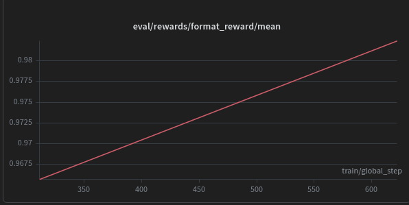
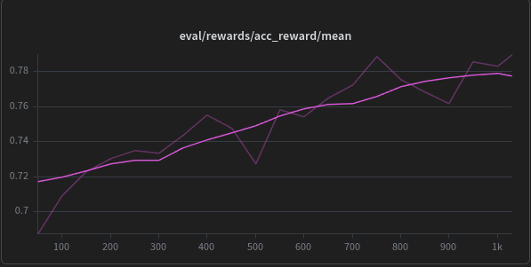

# Abstract

*Reinforcement Learning from Verifiable Rewards* (RLVR) improves problem-solvin skills in LLMs. In this project I’ll fine tune open weights models to investigate the underlying reasoning mechanism acquired during *RLVR.* Training will be conducted using the *GSM8K* for mathematical reasoning and the *HumanEval* dataset for coding task. We aim to understand how *RLVR* enhances mathematical and algorithmic reasoning capabilities at mechanist level.

# Goal

The academic community is currently debating how *RLVR* alters model parameters. Specifically it remain unclear whather the model already possesses the necessary knowledge with *RLVR* merely creating routing pathways to extract the correct answer or, if *RLVR* induces the creation of novel features.

Considering the transformers architecture as a residual stream manipulated by Attention Heads and MLPs, we aim to investigate the extent to which *RLVR* modifies internal representation versus merely acting as a behavioral wrapper.

To formalize this, we define two competing hypotheses:

- $H_0$ **(Steering Hypothesis):** RLVR acts purely as a routing mechanism. It modifies the Attention circuits to steer pre-existing knowledge without creating new features in the MLPs.
- $H_1$ **(Representation Learning Hypothesis):** RLVR forces the crystallization of new logical circuits, fundamentally altering the latent features encoded within the MLP layers

To test these hypotheses, we will analyze three distinct training phases of the same model:

1. **Vanilla Phase**: The base pre-trained model before any domain-specific exposure.
2. **Supervised Fine-Tuning (SFT) Phase**: The model trained via next-token prediction on our datasets without *RLVR* (acting as a baseline for formatting and basic knowledge acquisition).
3. **RLVR Phase**: The model fine-tuned using RLVR on the same datasets

By isolating these internal components, we will study:

- **Self-Attention**: To evaluate if *RLVR* merely establishes pathways toward the correct answer.
- **MLP**: To check if *RLVR* alters weights or activations within the feed-forward layers, which would strongly suggest the acquisition of new knowledge/features.

# Experiments List

1. **Component-Level Representation Comparison**
    
    For each problem type, we will extract the hidden states across the three model versions ($h^{v}_l, h^{SFT}_l$, $h^{RLVR}_l$). Instead of solely comparing global states, we will isolate the outputs of the Attention $z_l$ and MLP $m_l$ blocks. We will use Centered Kernel Alignment to measure representational similarity, identifying which specific component diverges most heavily after *RLVR*.
    
2. **Linear Probing & Causal Intervention**
    
    We will train linear classifiers on the hidden states to predict correct intermediate reasoning steps, paired with Logit Lens analysis to map intermediate representations to the vocabulary space. To establish causality, we will employ **Activation Patching** (Causal Tracing): by injecting specific activations from the *RLVR* model into the SFT model during inference, we aim to definitively prove whether a specific MLP or Attention layer holds the critical reasoning features.
    
3. **Weight Distance & Spectral Analysis**
    
    To quantify parameter updates, we will compute the $L_2$ norm of the weight differences: $||W_{RLVR} - W_{SFT}||$ and $||W_{RLVR} - W_v||$. To overcome the limitations of $L_2$ orms in overparameterized networks, we will perform Singular Value Decomposition (SVD) on the weight difference matrix $\Delta W$. If *RLVR* primarily acts as a steering mechanism, the weight updates should exhibit a low rank and concentrate in specific routing heads rather than MLP layers.

# Training Setup

We have chosen Qwen2.5-3B and Mistral ## as the model on which the perform our experiments. We have trained them, first train was with Super-Vised Fine-Tuning on GSM-8K, and secondo train was with RLVR on GSM-8K, this is how we got it Qwen2.5-G1-3B and Mistral##. 

## Rewards

We have used three different reward : 

- **Format Reward :** That control if the model output follows the format instruction, give the model $+1$ if the formato is follows, and give the model $-1$ if the format is not follows, we call it $R_f$
- **Accuracy Reward :** Check if the model answer is mathematics correct, give the model $+1$ if is correct else $0$, we call it $R_a$
- **Concise-Accuracy Reward :** It is a condional bonus on correcteness that decreases with the lenght of model answer and increases over time through a curriculum. We indicate :
    - $t$ : as global_step of trainer
    - $L$ : token-lenght of the completions (model answer)
    - $y$  : ground-truth
    - $\hat{y}$ : mathematics model answer
    
    Now define the accuracy function as follows : 
    
    $C(\hat{y}, y) = \begin{cases} 1 \text{ if } y = \hat{y} \\ 0 \text{ else} \end{cases}$.

    The reward use a progressive activation, which we have defined as $\alpha(t) = \min(1, \frac{t}{200})$.
    Now define $L_t$, which is the token-lenght target and $S$, which is fade-span, then we compute $\text{overflow}(L) = max(0, L-L_0)$ and concise bonus $b(L) =max(0, 1 - \frac{\text{overflow}(L)}{S})$. In the end we have $R_{ca} = \alpha(t)C(\hat{y},y)b(L)$
    

The final reward function is : $R = \lambda_f R_f + \lambda_a R_a + \lambda_{ca} R_{ca}$ that are : $[1.0, 0.2,0.1]$,
We have used $R_{ca}$ why in the first train, where we have used only $R_f$ and $R_a$, we have noticed an high $cap\_ratio$.

## Training Result
Training result are was good. The model (Qwen2.5-G1-3B) respect the format and has a good mathematics accuracy

 

Also the lenght of answer is good, we have mean_terminated_lenght $\sim  185$, this is means that all model answer has $ \sim 185 $ tokens, the clip_rato $\approx 0$. So now we have a model that solves mathematics discretely.