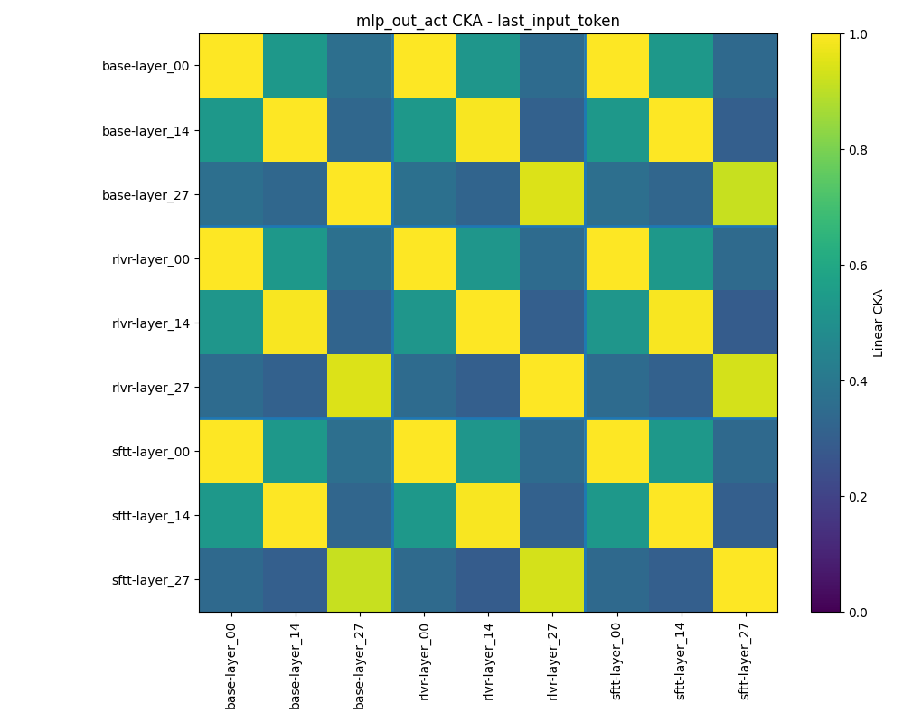
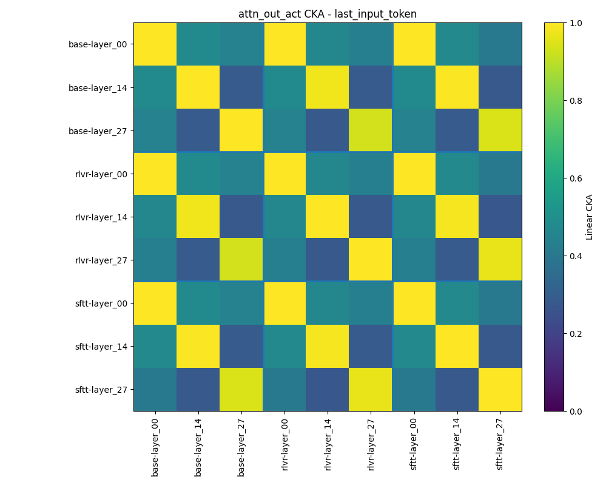
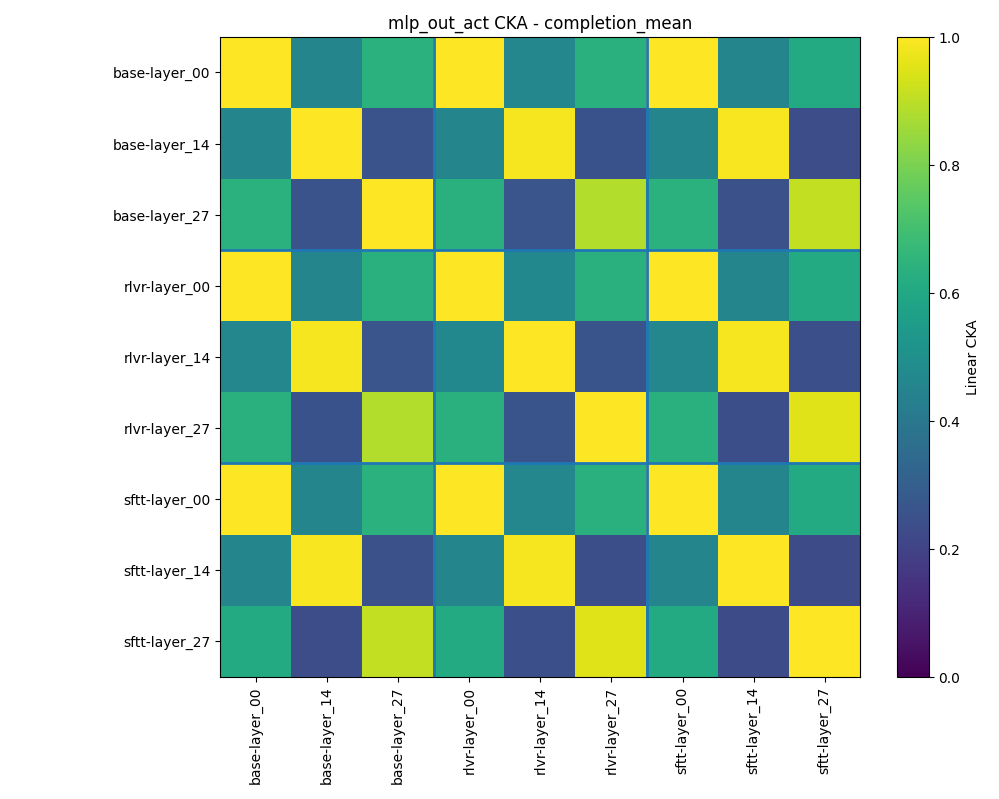
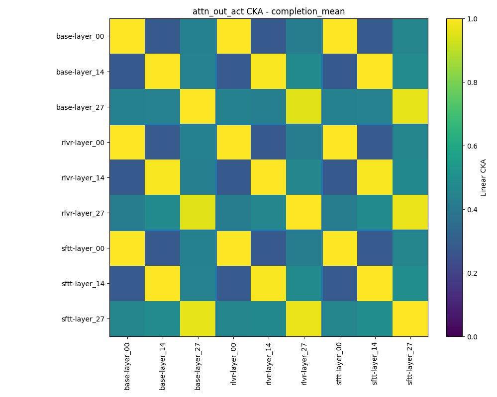

## Abstract 
Reinforcement Learning from Verifiable Rewards (RLVR) improves problem-solving skills in LLMs. In this project, I will fine-tune open-weights models to investigate the underlying reasoning mechanisms acquired during RLVR. Training is conducted using the GSM8K dataset for mathematical reasoning and the HumanEval dataset for coding tasks. We aim to understand how RLVR enhances mathematical and algorithmic reasoning capabilities at a mechanistic level.

## Goal 
The academic community is currently debating how RLVR alters model parameters. Specifically, it remains unclear whether the model already possesses the necessary knowledge (with RLVR merely creating routing pathways to extract the correct answer) or if RLVR induces the creation of novel features.

Considering the transformer architecture as a residual stream manipulated by Attention Heads and Multi-Layer Perceptrons (MLPs), we aim to investigate the extent to which RLVR modifies internal representations versus merely acting as a behavioral wrapper.

To formalize this, we define two competing hypotheses:

*   **Steering Hypothesis (H0):** RLVR acts purely as a routing mechanism. It modifies the Attention circuits to steer pre-existing knowledge without creating new features in the MLPs.
*   **Representation Learning Hypothesis (H1):** RLVR forces the crystallization of new logical circuits, fundamentally altering the latent features encoded within the MLP layers.

To test these hypotheses, we analyze three distinct training phases:
1.   **Vanilla Phase:** The base pre-trained model before any domain-specific exposure.
2.   **Supervised Fine-Tuning (SFT) Phase:** The model trained via next-token prediction (acting as a baseline for formatting and basic knowledge).
3.   **RLVR Phase:** The model fine-tuned using RLVR on the same datasets.

By isolating these internal components, we study:
*   **Self-Attention:** To evaluate if RLVR establishes pathways toward the correct answer.
*   **MLP:** To check if RLVR alters weights or activations within the feed-forward layers, which would suggest the acquisition of new knowledge.

---

# Training Setup

## Supervised Fine-Tuning
For the SFT stage, I used the NuminaMath-CoT dataset. This provides the model with basic mathematical reasoning patterns, solution structures, and the desired response format required before applying RLVR.

## RLVR Training
I constructed a mixed mathematical dataset using GSM8K, MATH-Lighteval (filtered by level), and DAPO-Math-17k. While SFT teaches the model to imitate traces, RLVR optimizes the model toward solution trajectories that maximize verifiable correctness.

## RLVR Configuration
Using the Hugging Face `trl` library, specifically `GRPOConfig` and `GRPOTrainer`:
*   **Learning Rate:** 2e-6
*   **Max Completion Length:** 2000
*   **Loss Type:** DAPO (chosen for its effectiveness with variable completion lengths).
*   **Infrastructure:** DeepSpeed for memory efficiency and vLLM for fast generation sampling.

---

# Experiments

## Dataset Building
We constructed a dataset of internal activations extracted from the BASE, SFT, and RLVR versions of the model. To ensure comparability, we use the RLVR model to generate a completion, then feed that exact sequence into all three models to extract activations at the same textual positions.

The sequence consists of the prompt and the completion. For every model and selected layer, we save:
*   **Pre-residual:** The input stream entering the layer.
*   **MLP output:** The specific contribution of the MLP block.
*   **Attention output:** The specific contribution of the Self-Attention block.

In a standard transformer layer, the "middle" residual state is the sum of the **pre-residual** and the **attention output**. The final "post-residual" state is the sum of that **middle state** and the **MLP output**.

### Activation Dataset Reproducibility

To reproduce the activation dataset, run `get_activation_dataset` from `experiments/experiments_main.py`.

This function builds a shared token cache using a generator model, then replays the same prompt-completion sequences through all model variants to extract comparable activations.

### Main inputs

- `gen_model`: model used to generate the completion.
- `gen_tokenizer`: tokenizer associated with `gen_model`.
- `gen_dataset`: dataset used for generation.
- `model_desc`: list of `(model_path, model_name)` pairs for the models to compare.
- `save_path`: directory where the activation dataset will be saved.
- `generator_name`: identifier of the model used for generation.
- `ood_dataset_name`: identifier of the evaluation dataset.
- `max_new_tokens`: maximum completion length used during generation.

### Saved files

Running the pipeline creates:

- `save_path/<dataset_name>.h5`: activation dataset in HDF5 format
- `save_path/<dataset_name>_metadata.pt`: lightweight metadata for the activation dataset
- `save_path/tokens_cache/<token_cache_prefix>.pt`: full token cache
- `save_path/tokens_cache/<token_cache_prefix>.jsonl`: JSONL export of the token cache

### Extraction procedure

1. The generator model produces one completion for each prompt in `gen_dataset`.
2. Prompt tokens and generated completion tokens are saved in a token cache.
3. The same full sequence (`prompt + completion`) is replayed through every model listed in `model_desc`.
4. Activations are extracted at the same token positions for all compared models.

### Current activation setup

At the moment, activations are extracted for:
- the first layer
- the middle layer
- the last layer

For each selected layer, the following activations are stored:
- `resid_pre_act`
- `attn_out_act`
- `mlp_out_act`

The saved token positions cover the full sequence:
- all prompt tokens
- all completion tokens

### HDF5 structure

```text
<dataset_name>.h5
│
├── <model_name_1>/
│   ├── index/
│   │   ├── sample_id
│   │   ├── start
│   │   ├── end
│   │   ├── prompt_len
│   │   ├── completion_len
│   │   └── total_len
│   │
│   ├── layer_00/
│   │   ├── mlp_out_act      # [total_tokens, d_model]
│   │   ├── attn_out_act     # [total_tokens, d_model]
│   │   └── resid_pre_act    # [total_tokens, d_model]
│   │
│   ├── layer_XX/
│   │   ├── mlp_out_act
│   │   ├── attn_out_act
│   │   └── resid_pre_act
│   │
│   └── layer_YY/
│       ├── mlp_out_act
│       ├── attn_out_act
│       └── resid_pre_act
│
└── <model_name_2>/
    ...
```

Here, `start` and `end` define the row span of each sample inside the flattened activation matrices.

### Notes
* The exact group names at the top level of the HDF5 file depend on the `model_name` values passed in `model_desc`.
* If you want to change which layers are extracted, modify the layer-selection logic in `extract_activation.py`.
* The token cache `.pt` file stores the generated tokenized dataset, while the `*_metadata.pt` file stores only lightweight metadata about the activation dataset.

## Component-Level Representation Comparison Summary

This analysis compares the internal representations (`attn_out_act` and `mlp_out_act`) of three model versions (BASE, SFT, and RLVR) using Centered Kernel Alignment (CKA) to determine if fine-tuning causes large global geometric changes. 

---

### Last Input Token
This strategy measures the final prompt state immediately before completion generation.

#### MLP output


The heatmap reveals strong same-layer structure. Layer identity is the dominant source of variation, indicating that fine-tuning does not globally rewrite MLP output geometry at this stage. Any changes are likely localized to specific directions or token contexts.

#### Attention output


Similarly, same-layer representations remain highly aligned. While RLVR does not induce massive global changes to Attention output geometry here, sparse or head-specific routing changes cannot be ruled out.

---

### Completion Mean
This strategy averages the hidden states of generated completion tokens, measuring how models represent the same generated reasoning sequence.

#### MLP output


Alignment is heavily structured by depth. Early and middle layers remain nearly identical across models. The largest drop in similarity occurs in the final layer (`layer_27`), where RLVR remains closer to SFT than BASE. This suggests fine-tuning primarily affects later layers rather than triggering a global rewrite.

| Layer    | base-sftt | base-rlvr | sftt-rlvr |
| -------- | --------: | --------: | --------: |
| layer_00 |    1.0000 |    0.9998 |    0.9998 |
| layer_14 |    0.9890 |    0.9884 |    0.9872 |
| layer_27 |    0.9172 |    0.8949 |    0.9565 |
| mean     |    0.9688 |    0.9611 |    0.9812 |

#### Attention output


Attention output geometry is even more preserved across versions than MLP, with a minimal late-layer drop. A head-level analysis is required to determine if specific token-level routing patterns change, as global geometry remains largely stable.

| Layer    | base-sftt | base-rlvr | sftt-rlvr |
| -------- | --------: | --------: | --------: |
| layer_00 |    1.0000 |    0.9999 |    1.0000 |
| layer_14 |    0.9982 |    0.9914 |    0.9919 |
| layer_27 |    0.9664 |    0.9606 |    0.9737 |
| mean     |    0.9882 |    0.9840 |    0.9885 |

---

### Interpretation
Across both components and slicing strategies, **same layer across models is more similar than different layers within/across models**. CKA primarily captures layer identity rather than training-stage identity. 

**Key Takeaways:**
* Early and middle layers are virtually unchanged across training stages.
* Fine-tuning effects are concentrated in the final layers, with MLP changing more than Attention.
* RLVR representations are generally closer to SFT than to BASE.

These findings provide weak evidence against a strong global Representation Learning Hypothesis (no broad reorganization of the feature space). However, they do not rule out localized representation changes within MLPs or the Steering Hypothesis (sparse, head-level routing changes).

<!-- The next analyses should therefore focus on more localized measurements:

* activation-difference norms between `SFT` and `RLVR`;
* per-token CKA over reasoning and answer positions;
* per-head Attention-output analysis;
* activation patching between SFT and RLVR. -->

<!-- To distinguish these possibilities, CKA should be complemented with more targeted analyses:

* same-layer numerical CKA tables;
* activation-difference norms between `SFT` and `RLVR`;
* per-token CKA around reasoning-step and final-answer boundaries;
* per-head Attention-output CKA;
* linear probes on specific reasoning positions;
* activation patching between SFT and RLVR. -->

## 2. Linear Probing & Causal Intervention
We train linear classifiers on the hidden states to predict correct intermediate reasoning steps. 
*   **Linear Probing Answer:** We take the activation vector for a reasoning token and pass it through a linear layer with a Softmax function to calculate the probability of specific classes among A, B, C or D.
*   **Activation Patching:** To establish causality, we inject specific activations from the RLVR model into the SFT model. This proves whether a specific MLP or Attention layer holds the critical features for successful reasoning.

## 3. Weight Distance & Spectral Analysis
To quantify parameter updates, we calculate the distance between the weight matrices of the models (using the L2 norm). 

To look deeper, we use **Singular Value Decomposition (SVD)** on the matrix representing the difference between weights. If RLVR is just a steering mechanism, these weight updates should show a "low rank"—meaning the changes are concentrated in a few specific routing heads rather than being spread across the MLP knowledge layers.
