## Abstract 
Reinforcement Learning from Verifiable Rewards (RLVR) improves problem-solving skills in LLMs. In this project, I will fine-tune open-weights models to investigate the underlying reasoning mechanisms acquired during RLVR. Training is conducted using the GSM8K dataset for mathematical reasoning and the HumanEval dataset for coding tasks. We aim to understand how RLVR enhances mathematical and algorithmic reasoning capabilities at a mechanistic level.

## Goal 
The academic community is currently debating how RLVR alters model parameters. Specifically, it remains unclear whether the model already possesses the necessary knowledge (with RLVR merely creating routing pathways to extract the correct answer) or if RLVR induces the creation of novel features.

Considering the transformer architecture as a residual stream manipulated by Attention Heads and Multi-Layer Perceptrons (MLPs), we aim to investigate the extent to which RLVR modifies internal representations versus merely acting as a behavioral wrapper.

To formalize this, we define two competing hypotheses:

*   **Steering Hypothesis (H0):** RLVR acts purely as a routing mechanism. It modifies the Attention circuits to steer pre-existing knowledge without creating new features in the MLPs.
*   **Representation Learning Hypothesis (H1):** RLVR forces the crystallization of new logical circuits, fundamentally altering the latent features encoded within the MLP layers.

To test these hypotheses, we analyze three distinct training phases:
1.   **Vanilla Phase:** The base pre-trained model before any domain-specific exposure.
2.   **Supervised Fine-Tuning (SFT) Phase:** The model trained via next-token prediction (acting as a baseline for formatting and basic knowledge).
3.   **RLVR Phase:** The model fine-tuned using RLVR on the same datasets.

By isolating these internal components, we study:
*   **Self-Attention:** To evaluate if RLVR establishes pathways toward the correct answer.
*   **MLP:** To check if RLVR alters weights or activations within the feed-forward layers, which would suggest the acquisition of new knowledge.

---

# Training Setup

## Supervised Fine-Tuning
For the SFT stage, I used the NuminaMath-CoT dataset. This provides the model with basic mathematical reasoning patterns, solution structures, and the desired response format required before applying RLVR.

## RLVR Training
I constructed a mixed mathematical dataset using GSM8K, MATH-Lighteval (filtered by level), and DAPO-Math-17k. While SFT teaches the model to imitate traces, RLVR optimizes the model toward solution trajectories that maximize verifiable correctness.

## RLVR Configuration
Using the Hugging Face `trl` library, specifically `GRPOConfig` and `GRPOTrainer`:
*   **Learning Rate:** 2e-6
*   **Max Completion Length:** 2000
*   **Loss Type:** DAPO (chosen for its effectiveness with variable completion lengths).
*   **Infrastructure:** DeepSpeed for memory efficiency and vLLM for fast generation sampling.

---

# Experiments

## Dataset Building
We constructed a dataset of internal activations extracted from the BASE, SFT, and RLVR versions of the model. To ensure comparability, we use the RLVR model to generate a completion, then feed that exact sequence into all three models to extract activations at the same textual positions.

The sequence consists of the prompt and the completion. For every model and selected layer, we save:
*   **Pre-residual:** The input stream entering the layer.
*   **MLP output:** The specific contribution of the MLP block.
*   **Attention output:** The specific contribution of the Self-Attention block.

In a standard transformer layer, the "middle" residual state is the sum of the **pre-residual** and the **attention output**. The final "post-residual" state is the sum of that **middle state** and the **MLP output**.

### Activation Dataset Reproducibility

To reproduce the activation dataset, run `get_activation_dataset` from `experiments/experiments_main.py`.

This function builds a shared token cache using a generator model, then replays the same prompt-completion sequences through all model variants to extract comparable activations.

### Main inputs

- `gen_model`: model used to generate the completion.
- `gen_tokenizer`: tokenizer associated with `gen_model`.
- `gen_dataset`: dataset used for generation.
- `model_desc`: list of `(model_path, model_name)` pairs for the models to compare.
- `save_path`: directory where the activation dataset will be saved.
- `generator_name`: identifier of the model used for generation.
- `ood_dataset_name`: identifier of the evaluation dataset.
- `max_new_tokens`: maximum completion length used during generation.

### Saved files

Running the pipeline creates:

- `save_path/<dataset_name>.h5`: activation dataset in HDF5 format
- `save_path/<dataset_name>_metadata.pt`: lightweight metadata for the activation dataset
- `save_path/tokens_cache/<token_cache_prefix>.pt`: full token cache
- `save_path/tokens_cache/<token_cache_prefix>.jsonl`: JSONL export of the token cache

### Extraction procedure

1. The generator model produces one completion for each prompt in `gen_dataset`.
2. Prompt tokens and generated completion tokens are saved in a token cache.
3. The same full sequence (`prompt + completion`) is replayed through every model listed in `model_desc`.
4. Activations are extracted at the same token positions for all compared models.

### Current activation setup

At the moment, activations are extracted for:
- the first layer
- the middle layer
- the last layer

For each selected layer, the following activations are stored:
- `resid_pre_act`
- `attn_out_act`
- `mlp_out_act`

The saved token positions cover the full sequence:
- all prompt tokens
- all completion tokens

### HDF5 structure

```text
<dataset_name>.h5
│
├── <model_name_1>/
│   ├── index/
│   │   ├── sample_id
│   │   ├── start
│   │   ├── end
│   │   ├── prompt_len
│   │   ├── completion_len
│   │   └── total_len
│   │
│   ├── layer_00/
│   │   ├── mlp_out_act      # [total_tokens, d_model]
│   │   ├── attn_out_act     # [total_tokens, d_model]
│   │   └── resid_pre_act    # [total_tokens, d_model]
│   │
│   ├── layer_XX/
│   │   ├── mlp_out_act
│   │   ├── attn_out_act
│   │   └── resid_pre_act
│   │
│   └── layer_YY/
│       ├── mlp_out_act
│       ├── attn_out_act
│       └── resid_pre_act
│
└── <model_name_2>/
    ...
```

Here, `start` and `end` define the row span of each sample inside the flattened activation matrices.

### Notes
* The exact group names at the top level of the HDF5 file depend on the `model_name` values passed in `model_desc`.
* If you want to change which layers are extracted, modify the layer-selection logic in `extract_activation.py`.
* The token cache `.pt` file stores the generated tokenized dataset, while the `*_metadata.pt` file stores only lightweight metadata about the activation dataset.

## 1. Component-Level Representation Comparison Summary

This analysis compares internal representations across three model training stages—**BASE**, **SFT**, and **RLVR**—to determine if fine-tuning causes large global changes in the geometry of Attention and MLP outputs. We compute **linear Centered Kernel Alignment (CKA)** between pairs of model-layer representations using two component outputs: `attn_out_act` and `mlp_out_act`. 

Activations of shape `[L, seq_len, d_model]` are sliced into `[N, d_model]` matrices using two distinct strategies.

---

### 1.1 Last Input Token 
We study the geometry of the activations at the position of the last input token, that is, in the state that conditions the distribution of the first token generated by the model.

#### MLP 
The geometry remains globally very similar across the models, but the reduction in CKA in the final layers indicates that the differences introduced by fine-tuning are mainly concentrated in the deep layers.

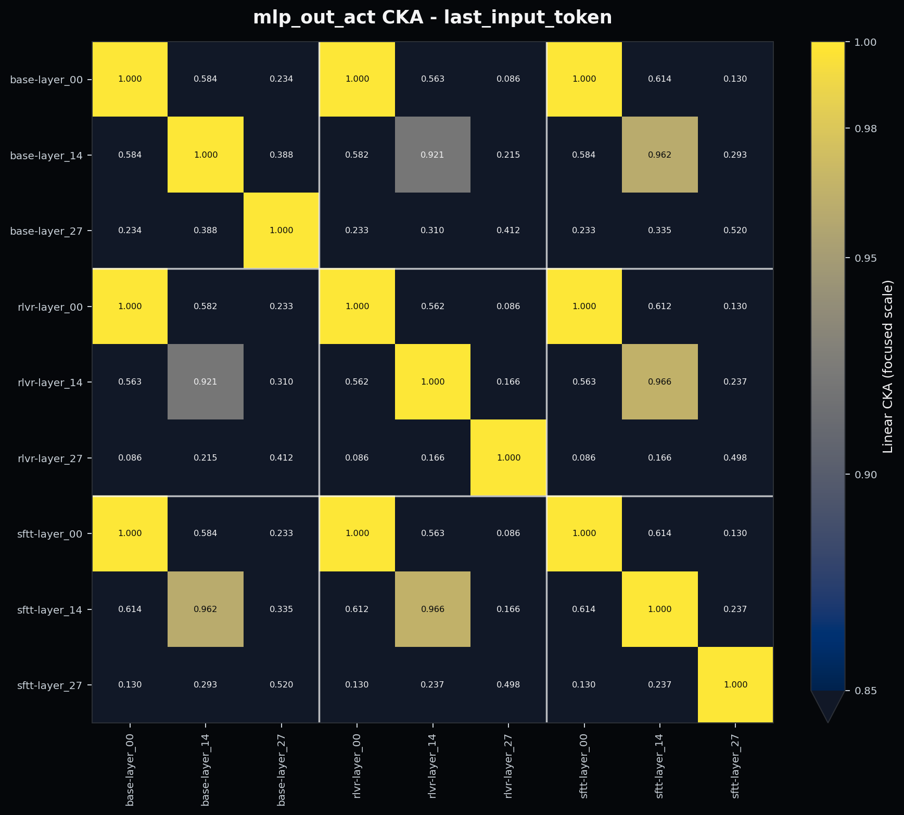

Observing the table of numerical **CKA** values we have confirmation: The geometries change more in the deeper layers.
| Layer | base-sftt | base-rlvr | sftt-rlvr |
| --- | ---: | ---: | ---: |
| layer_00 | 1.0000 | 0.9999 | 0.9999 |
| layer_14 | 0.9617 | 0.9215 | 0.9658 |
| layer_27 | 0.5200 | 0.4123 | 0.4981 |
| mean | 0.8272 | 0.7779 | 0.8213 |

`layer_27` is the one showing the largest change. By studying these changes, we can notice that the final-layer MLP geometry shifts strongly across all model pairs, with the largest drop in the `base-rlvr` comparison. As already shown in [Filtering with Self-Attention and Storing with MLP One Layer Transformers Can Provably Acquire and Extract Knowledge](https://arxiv.org/pdf/2508.00901v3a), supervised fine-tuning refines the knowledge embedded in the MLPs of the base model, trained on next-token-prediction (NTP). This is also consistent with the **CKA** values observed in the table.

The fact that `base-rlvr` is the least similar comparison suggests that, at least on the last input token, RLVR introduces a sharper final-layer MLP geometric shift with respect to the base model.

In subsequent tests, we compare these results with the attention activations, to verify if the same pattern is also observed in the routing modules.

### 1.2 Predictive completion mean
We want to study the intensity of the geometric change on the positions that predict the tokens of the generated completion. This test aggregates the activations along the reasoning sequence, allowing us to compare the average geometry used by the models during generation.

We take the token sequence corresponding to all generated tokens and calculate the mean along the token axis: 
```python 
pred_start = prompt_len - 1
pred_end = prompt_len + completion_len - 1
act = act[:, pred_start:pred_end, :].mean(dim=1)
```

Thanks to this structure, we can study how the geometries of the models vary on activations of tokens predicted during the reasoning steps. Observing the heat-maps, we can notice a fairly repetitive pattern: The geometries between the same layers of different models do not change excessively.

#### MLP
In the MLP we have a higher intensity, mostly isolated on the last layer; in fact, layers `layer_00` and `layer_14` have very similar if not identical geometries. Observing `layer_27`, we notice a more marked reduction in CKA, hence a greater geometric difference between the models.

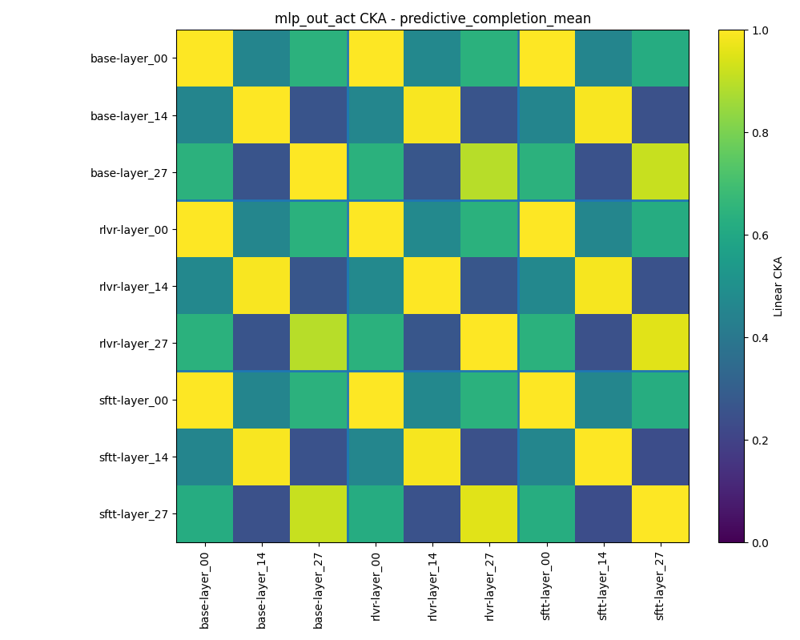

Observing the table of complete **CKA** values also confirms this pattern: 
| Layer | base-sftt | base-rlvr | sftt-rlvr |
| --- | ---: | ---: | ---: |
| layer_00 | 1.0000 | 0.9998 | 0.9998 |
| layer_14 | 0.9892 | 0.9888 | 0.9865 |
| layer_27 | 0.9183 | 0.8930 | 0.9544 |
| mean | 0.9692 | 0.9605 | 0.9802 |

The deeper layers are the ones that have a greater variation in geometry. We can also notice how the geometries between `sftt-rlvr` are much more similar compared to `base-rlvr`, contrary to what was seen on the activations of the last input token.

During the generation of the completion, the geometry of rlvr is closer to that of sftt than to that of the base model. This suggests that RLVR preserves a significant part of the representational structure introduced by SFT during the generation of the reasoning.

#### Attention 
The attention shows geometries that are much more similar to each other compared to those of the MLP; from the heat-map, no easily noticeable changes are highlighted.

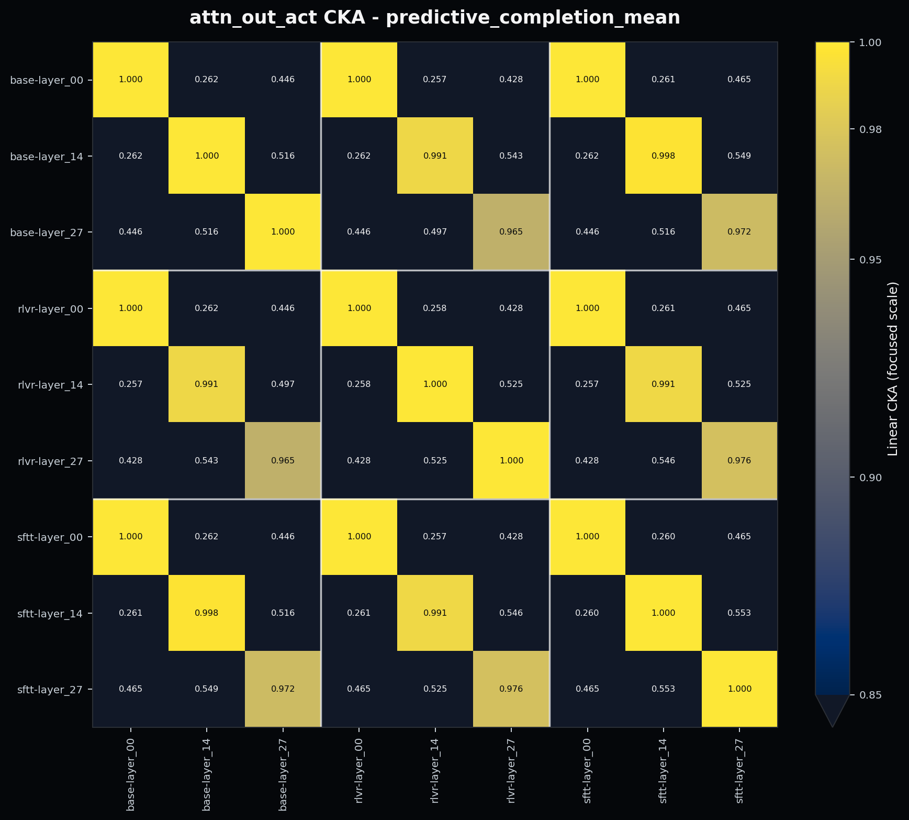

Looking at the table of **CKA** values we can notice two interesting patterns: 
- The attention geometries of the `base` model and the `sftt` model are closer compared to the MLP geometries.
- The attention geometries of the `sftt` model and the `rlvr` model are closer compared to the MLP geometries.

| Layer | base-sftt | base-rlvr | sftt-rlvr |
| --- | ---: | ---: | ---: |
| layer_00 | 1.0000 | 0.9999 | 1.0000 |
| layer_14 | 0.9980 | 0.9905 | 0.9909 |
| layer_27 | 0.9721 | 0.9649 | 0.9755 |
| mean | 0.9900 | 0.9851 | 0.9888 |

[A Mathematical Framework for transformer Circuits](https://transformer-circuits.pub/2021/framework/index.html#splitting-attention-head-terms-into-circuits) Since we measure `attn_out` here, the result does not directly identify changes in QK routing patterns. Rather, it indicates that the output written by the attention into the residual stream, OV, remains geometrically more stable compared to the MLP outputs. In the studied setup, the greater geometric stability of `attn_out` suggests that the differences introduced by SFT and RLVR are more visible in the MLPs than in the attention output. This does not rule out a role for attention, but indicates that the change does not clearly emerge from this specific measure.

The activations in the comparisons are very similar; this does not indicate that the attention would have predicted very similar token distributions, but by observing the geometric changes we can highlight that `sftt` and `rlvr` had a greater impact on the MLPs. From these two tables, we can highlight that, although marginal, there are changes in the geometries of the different components, with an MLP that receives a greater intensity of change, on average, compared to the attention.

### 1.3 Position Completion
In this way, we can study how the geometry of the activations changes in different normalized positions of the completion, verifying if the differences between models increase as the reasoning proceeds.
```python 
rel_idx = int(round((completion_len - 1) * normalized_pos))
rel_idx = _clamp(rel_idx, 0, completion_len - 1)
abs_idx = completion_start + rel_idx
return act[:, abs_idx, :]  
```

This way we can study how the activation geometries of the three models change across the token length of the completion; it is useful to see with what geometry the models represent the reasoning.

#### MLP 
Observing the heat-map, we can see that the geometries between the layers remain very similar: 
- `layer_00`: The geometries remain very similar. 
- `layer_14`: Here too, the geometries remain very similar. 
- `layer_27`: Here the greatest difference in geometries is perceived, albeit marginal.

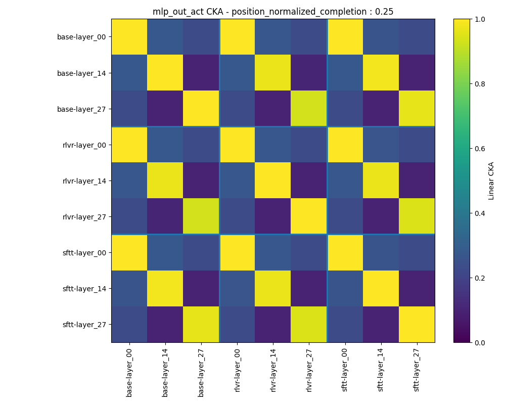

Observing the table that returns the full **CKA** score: 
| Layer | base-sftt | base-rlvr | sftt-rlvr |
| --- | ---: | ---: | ---: |
| layer_00 | 1.0000 | 0.9995 | 0.9996 |
| layer_14 | 0.9847 | 0.9705 | 0.9709 |
| layer_27 | 0.9622 | 0.9144 | 0.9424 |
| mean | 0.9823 | 0.9615 | 0.9709 |


The previously seen pattern is confirmed again; the MLP blocks are the ones that have a greater intensity of geometric change compared to the attention. The MLP activations of the first `25%` of the generated tokens show how the geometries are close, indicating that to generate the first `25%` of the tokens the models do not drift excessively from each other.

Reaching up to `75%` of the generated tokens, we get closer to the previously seen pattern.
| Layer | base-sftt | base-rlvr | sftt-rlvr |
| --- | ---: | ---: | ---: |
| layer_00 | 1.0000 | 0.9995 | 0.9995 |
| layer_14 | 0.9873 | 0.9730 | 0.9757 |
| layer_27 | 0.9788 | 0.9249 | 0.9453 |
| mean | 0.9887 | 0.9658 | 0.9735 |

At 75% of the completion, the largest difference still emerges in the `base-rlvr` comparison, while `sftt-rlvr` remains closer. This suggests that, in the intermediate phases of the completion, RLVR separates more from the base model while maintaining a geometry closer to SFT.

Reaching up to `95%` of the generated tokens, the pattern is confirmed: 
| Layer | base-sftt | base-rlvr | sftt-rlvr |
| --- | ---: | ---: | ---: |
| layer_00 | 0.9999 | 0.9995 | 0.9995 |
| layer_14 | 0.9582 | 0.9135 | 0.9478 |
| layer_27 | 0.7016 | 0.6826 | 0.8696 |
| mean | 0.8866 | 0.8652 | 0.9390 |

This time we have much more different geometries among them; the pattern is confirmed again to be greater in the deep layers.

The geometries of the last layer shift significantly, especially in `base-rlvr`, indicating that the activations have changed between the two. This sharp drop in CKA compared to the base model suggests that, towards the end of the completion, SFT and RLVR traverse representational regions more distant from those of the base model. A possible hypothesis is that the deep MLP layers encode or combine features more specific to mathematical reasoning.
The most marginal difference remains between `sftt-rlvr`, indicating that between the two versions of the model the activation geometries are much more similar. This could be due to the fact that the MLP features of `rlvr` manage to activate more compared to the features of `sftt`, precisely because RLVR might have made the use of some representations already acquired during SFT more systematic.

#### Attention 
Also for the attention, the geometries remain very similar. Compared to the MLPs, the changes are more contained: in the heat-map, the differences visible in the MLPs are almost completely absent.

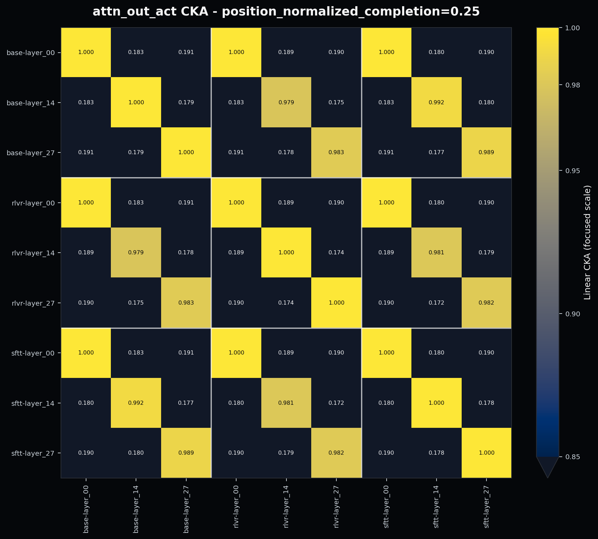

Observing the table of activations up to `25%` of the generated tokens, we can notice a much more contained change in geometries compared to the MLPs. Moreover, the scores remain highly aligned with those seen in the previous test.
| Layer | base-sftt | base-rlvr | sftt-rlvr |
| --- | ---: | ---: | ---: |
| layer_00 | 1.0000 | 0.9999 | 0.9999 |
| layer_14 | 0.9919 | 0.9793 | 0.9811 |
| layer_27 | 0.9890 | 0.9828 | 0.9822 |
| mean | 0.9936 | 0.9873 | 0.9878 |

Going up to `95%` of the generated tokens, we notice the same pattern noted in the MLP, the geometries differentiate more: 
| Layer | base-sftt | base-rlvr | sftt-rlvr |
| --- | ---: | ---: | ---: |
| layer_00 | 1.0000 | 0.9999 | 0.9999 |
| layer_14 | 0.9579 | 0.9430 | 0.9673 |
| layer_27 | 0.8828 | 0.9153 | 0.9041 |
| mean | 0.9469 | 0.9527 | 0.9571 |

The change in the attention activations with greater reasoning depth could be due to the fact that the attention has learned new patterns among tokens; with this, it might have learned to pay more attention to tokens that it previously considered uninformative.
Unlike the MLPs, in the attention the most distant comparison is not always base-rlvr; at layer_27, the lowest value is base-sftt. This suggests that the changes in the attention are weaker and less structured compared to those observed in the MLPs.

Since this test measures `attn_out` and not directly the attention probabilities, we cannot conclude that the model has learned new routing patterns. We can, however, observe that towards the end of the completion, the attention output also shows a reduction in geometric similarity between models. 

Recent literature on RLVR highlights that training with verifiable rewards can be associated with entropy reduction dynamics and a greater concentration of the distribution on the tokens. However, from the CKA results on `attn_out` alone, we cannot attribute this dynamic to the attention. To verify this, it will be necessary to compare logit entropy, Logit Lens/Logi-Lens and, separately, causal interventions on MLP and attention [Towards a Mechanistic Understanding of LRM - A survey of training and inference.](https://arxiv.org/pdf/2601.19928).

The MLP shows greater geometric variation compared to the attention, because the CKA values are lower.
| Activation module | base-sftt | base-rlvr | sftt-rlvr |
|-------------------|------------|-----------|----------|
| Attention         | 0.9469    | 0.9527     | 0.9571   |
| **MLP**           | **0.8866** | **0.8652** | **0.9390** |

### Interpretation 
The CKA results show that SFT and RLVR do not produce a global reorganization of the representations, given that the geometric similarity remains high in most layers and positions. However, the differences increase in the deep layers, especially in the MLP outputs and in the final positions of the completion. This suggests that fine-tuning acts more heavily on the deep MLP components during the generation of the reasoning, while the attention output remains more stable. Furthermore, the greater closeness between sftt and rlvr during the completion indicates that RLVR seems to preserve part of the representational structure introduced by SFT, rather than producing a completely new geometry.

## 2. Linear Probing & Causal Intervention
### 2.1 Netive-Logit Lens
Logit Lens was performed using previously saved activations; through this experiment, we want to analyze how the probability distributions on output tokens evolve based on the completion percentage within the activations used. The setup is as follows:

We take all the activations saved in our dataset and reconstruct an approximation of the internal residuals: `attention_residual = resid_pre_act + attn_out_act` and `resid_post = attention_residual + mlp_out_act`; subsequently, we extract the prediction-lenses of the three models, obtaining:

* `base_lens`
* `rlvr_lens`
* `sftt_lens`

Each model uses its own prediction-lens in the `lens = native` setting, while they use a shared prediction-lens in the `lens = shared` setting.

To each lens, we provide as input the `residual_module` calculated on a percentage of completion tokens: **10%**, **50%**, **90%**, and **95%**; we then study the evolution of various metrics with respect to the modules, the model depth (based on the layers), and finally according to the completion token percentage.
The metrics we will analyze are averaged along the samples axis; within our code, each metric is saved with a shape of `[B, L]`, where `L` represents the layer and `B` the batch; to study the metrics, we average over `B`. Unfortunately, the hardware setup on which the experiments were run is limited, and consequently, the variation across samples is also limited.

---

#### 2.1.1 Component-Level Logit Divergence: Top-K Overlap and Symmetric KL
We use Jaccard similarity to measure the overlap of the top-k tokens predicted by the models, while Symmetric KL Divergence is used to quantify how much the distributions over the output vocabulary differ.
For each model, normalized position, module, and layer, we collect:
* Selected activation
* We apply the prediction lens to the activation
* We obtain the logits with shape `[L, V]` via the prediction lens

*Jaccard*
We extract the top-k tokens: `top_ids = logits.top(k = top_k, dim = -1).indices`
```python
matches = top_ids_a.unsqueeze(-1) == top_ids_b.unsqueeze(-2)
intersection = matches.any(dim=-1).sum(dim=-1).float()
union = 2 * K - intersection
jaccard = intersection / union
```

*Symmetric KL*
```python
log_p = logits_a.log_softmax(dim=-1)
log_q = logits_b.log_softmax(dim=-1)

p = log_p.exp()
q = log_q.exp()

kl_pq = (p * (log_p - log_q)).sum(dim=-1)
kl_qp = (q * (log_q - log_p)).sum(dim=-1)

dkl = 0.5 * (kl_pq + kl_qp)
```

---

**DKL Attention** :
In the first layer, the distributions tend to be very similar across all compared pairs. Similarly, in the last layer, the distributions tend to be very similar to one another. From position 0.90, we can observe that (base, rlvr) tends to have a higher score, indicating that the distributions of the two models are slightly more divergent; this is particularly evident at position 0.95. The highest scores are achieved at the intermediate layer, indicating that this is where the distributions diverge the most.

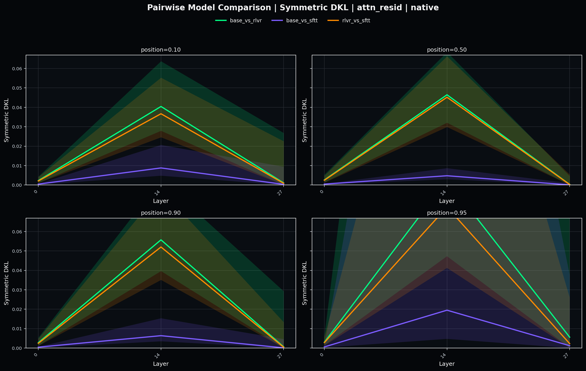

The (base, rlvr) comparison is the one that, in the intermediate layer, yields the most distant distributions, followed immediately by (rlvr, sftt), while (sftt, base) yields the most similar distributions. In both comparisons, the distributions diversify at layer 14. Observing the scores of (base, rlvr) and (rlvr, sftt), we can see that as the position progresses, their two scores draw closer; observing the evolution of the intermediate layer across positions, we notice that the two scores not only tend to increase but also to converge, especially at position 0.95.

---

**DKL-MLP** : The (base, sftt) pair continues to be the one with the lowest score, indicating that the two models return very similar distributions; the trend that follows is very similar to the one already seen previously. The scores of the (rlvr, sftt) and (base, rlvr) pairs in the first layer of all positions have increased compared to before; it also shows a growth pattern across positions, with the (base, rlvr) pair showing a slightly higher score than all the others. The scores of the last layer, again regarding these two model pairs, have also changed at several points: the first is the last layer of the first position, where the two pairs converge to the same score, which is the highest one, indicating distributions that are similar but not excessively so; following the positions, we can notice how the scores flatten out again at position 0.50, and then resume distancing themselves later; the strongest distancing occurs at position 0.95, where the (base, rlvr) distributions are the most different.

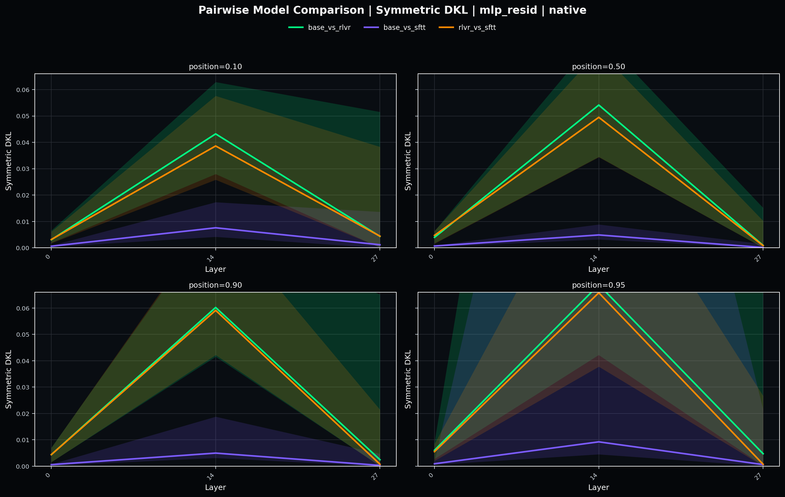

The (base, rlvr) and (rlvr, sftt) pairs show higher scores than before; in addition to this, they also show a greater distancing compared to what was seen in **DKL-Attention**, especially at positions 0.10 and 0.50; at position 0.90, however, the opposite happens: in **DKL-Attention** the two scores remain roughly distant, while here the two scores almost converge on the same point.

---

**Symmetric KL Interpretation** : The addition of the MLP signal has an evident impact on the distributions: they differ little in the initial and final layers, while they specifically diversify in the intermediate one. The increase in distance in the (base, rlvr) distributions of the last layer is a trend that emerges especially in the final positions. Given how the completions are constructed, the tokens within the last positions, 0.90 and 0.95, should be, with high probability, the tokens associated with the final answer; the fact that the MLP shifts the probability mass in those positions could indicate that the MLP has a greater effect, compared to Attention, on the distribution of the final answer tokens. Another signal that emerges is that the MLP shifts the distributions of the intermediate layer the most.

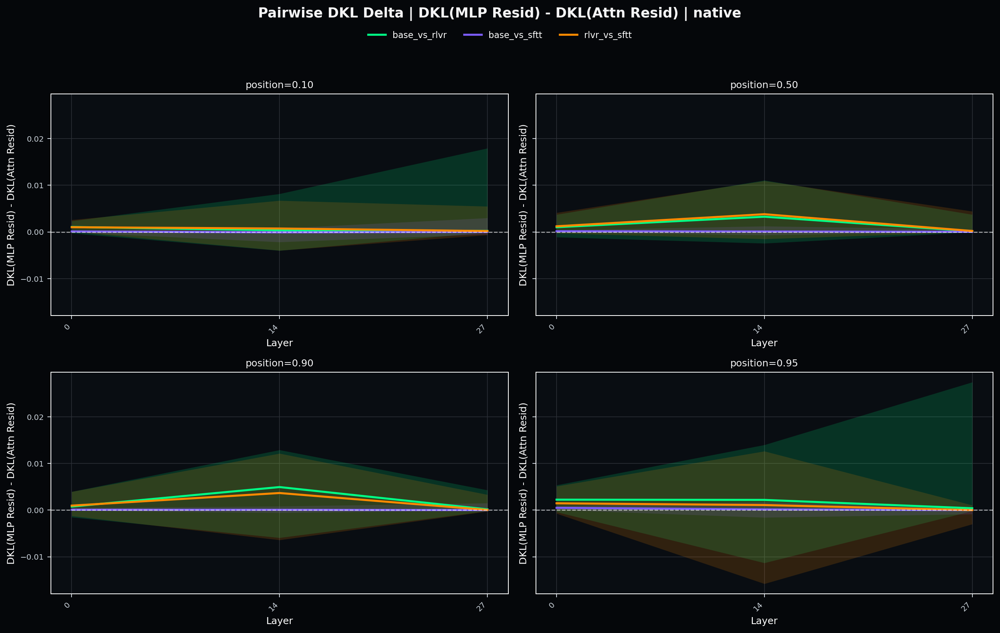

Looking at the delta, we notice how it tends to be greater than or equal to zero; if the delta is equal to zero, it means that the two DKL scores are equal and cancel each other out; if, instead, the score is greater than zero, it means that the DKL score of the MLP is the larger one and therefore the one that shifts the distributions more. Observing the graphs, we notice that the scores greater than zero are mainly in the intermediate layer, particularly for positions 0.50 and 0.95, and in the initial layer of position 0.95. These two patterns confirm that the MLP shifts the distribution especially in the intermediate layer; since the MLP is associated with knowledge storage and extraction, we might think that the intermediate layer is the point where knowledge is most extracted. In the last position, we notice that the initial layer has the highest scores; as the layers progress, the scores converge to zero. However, looking at the uncertainty band, the estimate is less stable across samples: some completions show a much more divergent MLP contribution, while others show a more divergent or almost null attention contribution.

--- 

**Jaccard-Attention** : The (base, sftt) pair is the one with the most tokens in common across all layers and all positions. In the first layer of position 0.10, the pair with the fewest tokens in common is (base, sftt); in the intermediate and final layers, their **Top-K Jaccard** score converges with the (base, rlvr) score. The scores converge to the same points in all layers of positions 0.50 and 0.90, and diverge again in the last layer of position 0.90, where (base, rlvr) are the models with the fewest tokens in common.

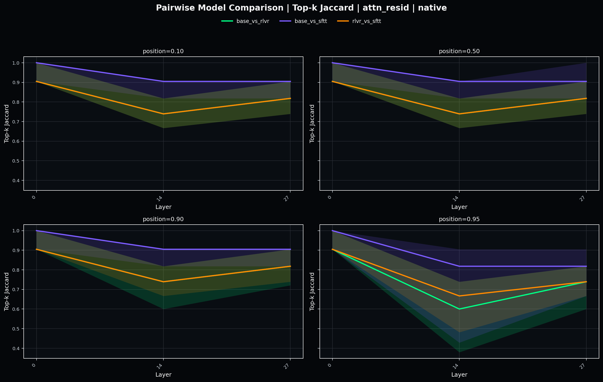

All comparisons in the initial layer have many tokens in common; this number decreases in the intermediate layer and increases again in the final layer, without, however, reaching the initial layer's score. As previously seen, the intermediate layer is where the distributions tend to diverge the most; we can observe how the intermediate layer is also the one that yields a modest diversity of tokens compared to the other layers.

--- 

**Jaccard-MLP** The pairs (rlvr, sftt) and (base, rlvr) have the same scores in all layers of positions 0.90 and 0.95; the number of common tokens for the models in these positions is therefore the same. (base, sftt) continues to return the highest scores, indicating that the models continue to share many tokens; its scores follow an identical pattern to the one seen in **Jaccard Attention**. For all positions and comparisons, the initial layer is the one with the most tokens in common; in the intermediate layer, the number decreases and remains stable until the final layer, except for (rlvr, sftt) at position 0.50, where in the last layer the common tokens increase compared to those observed in the intermediate layer.

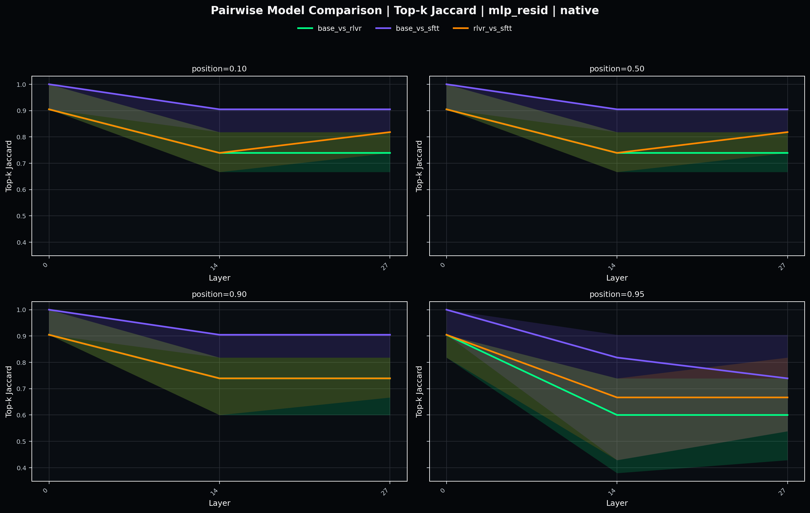

In the first positions, although for different layers, the (base, rlvr) pair is the one that tends to have the lowest number of common tokens; indeed, observing the final layers of positions 0.10 and 0.50, we notice how the two models return a lower score compared to the others; the same applies to the intermediate layer of position 0.10. In position 0.10, the (rlvr, sftt) models have more tokens in common compared to those observed before.

---

**Top-K Jaccard Interpretation** Generally, the (base, sftt) models have many tokens in common, especially compared to the other comparisons; the (base, rlvr) models, on the other hand, are those that tend to have fewer tokens in common in the initial positions. This shows how the rlvr model structures initial reasoning with a different semantics compared to the other models, a semantics that remains close to that of the sftt model.

The addition of the MLP has made the common tokens between the intermediate and final layers more stable; especially in the final layer, it yielded a much more diverse number of tokens compared to what was observed with Attention alone. This is confirmed by the **Jaccard Delta** graph: when the graph goes below zero, it means that attention returns more tokens in common between the two models.

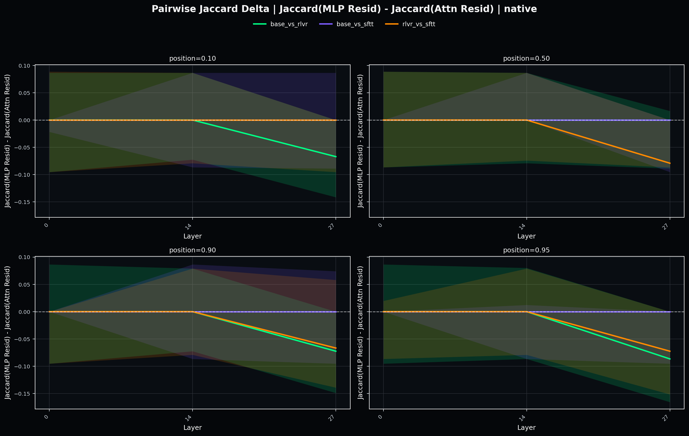

We can notice how (base, rlvr) is always below zero in the last layer, indicating that it is the MLP that encourages different tokens between the two models. As seen in [Towards a Mechanistic Understanding of LRM - A survey of training and inference.](https://arxiv.org/pdf/2601.19928), RLVR models undergo two training stages; in the second stage, they learn to use optimal tokens. Observing our graphs, it is plausible to think that the MLP might provide a greater contribution to optimal tokens by leveraging learned knowledge; we do not have certain proof of this, but it is a hypothesis that should not be excluded and is not entirely unrealistic.

#### 2.1.2 Attention vs MLP Target Log-Probability Contribution
*Suggestions for improving the tests: 1) Add token windows 2) Bootstrap Confidence Intervals 3) Increase the density of the analyzed layers*

After extracting the logits by applying the lens to the activation, we calculate the log-probability on them: `log_probs = logits.log_softmax(dim = -1)`, after which we calculate:

```python
delta_attn_logprob = attn_resid - resid_pre
delta_mlp_logprob  = mlp_resid - attn_resid

```

The two deltas measure how much the log-probability of the target token changes when adding the respective contribution of the Attention and MLP to the residual stream.
We will then also analyze the gap between the two deltas; this analysis serves to confirm which component has a greater impact on the log-probability for predicting the target token. Specifically, we will analyze `delta_mlp_logprob - delta_attn_logprob`.

**Delta Attention LogProb**
Observing the graph, in the initial layer, the attention is the component that shifts the distribution towards the target token; in the deeper layers, however, the attention brings no change to the log-prob.

Observing the graph that zooms in on the intermediate and final layers, we notice how the attention decreases its contribution to the target token. In the initial position, its effect on the log-prob is almost zero; in the subsequent positions, we see that the effect returns to being high, although closer to zero compared to the initial layer.
In the last position, we also notice the first difference across the models: in sftt, the effect of the attention is lower compared to the effect it has on rlvr and base.

|  |  |
| :---: | :---: |
|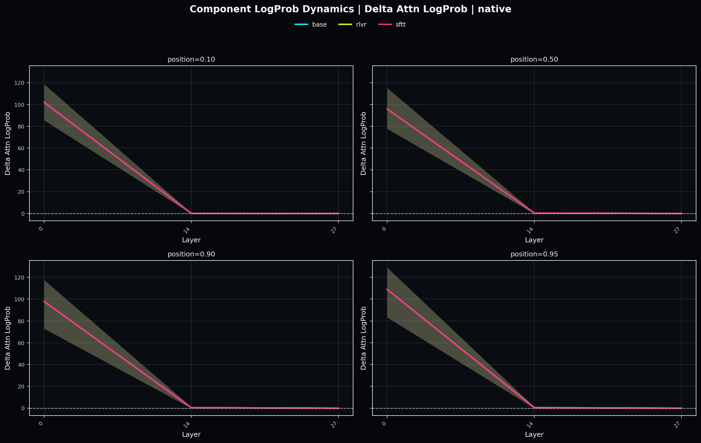       | 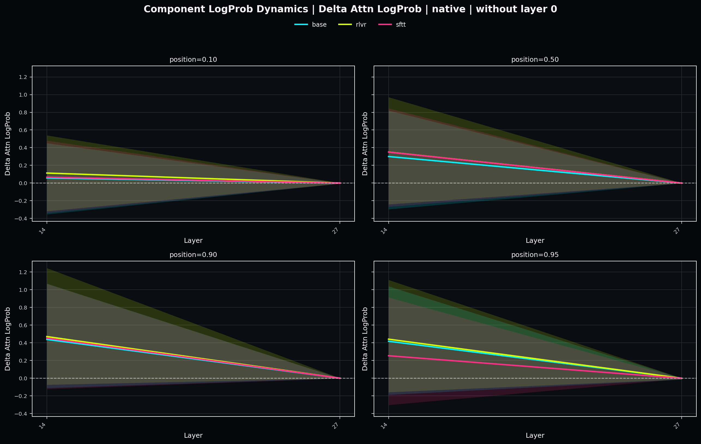 

In the first two positions, the uncertainty bands go below zero, indicating that for some samples it is the MLP that shifts the distribution to favor the target token; in the last two positions, this effect has a smaller scale.

**Delta MLP LogProb**
Reconfirming what was seen previously, the graphs on the delta MLP log-prob show an MLP that does not favor the target token, especially in the first layers. Here too, the uncertainty bands show that the MLP shifts the probability score towards the token only in some samples.

|  |  |
| :---: | :---: |
|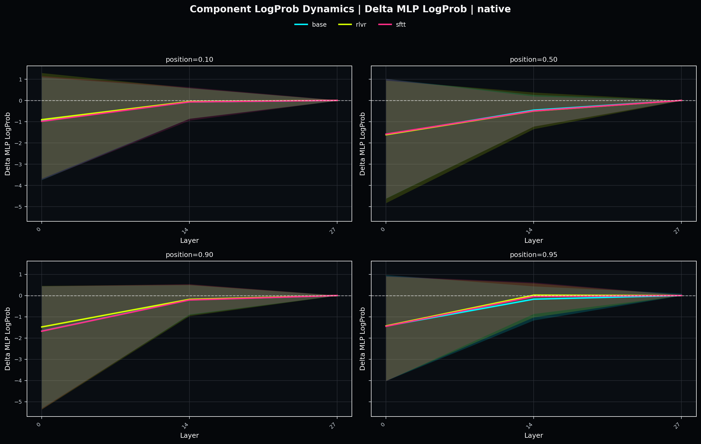       | 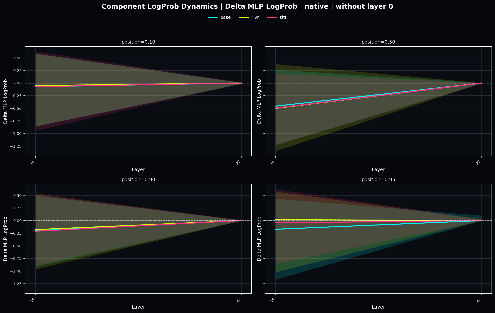

Zooming in on the last two analyzed layers, we can notice wider uncertainty bands that tend to go above zero, especially in the first and last positions. In the last position, the MLP is the one that shifts the distribution the least; in the rlvr model, however, the effect is the most marked.

**Components Preference** The component preference shows how the **Delta Attention LogProb** is the one that tends to be larger; however, as the layers progress, it tends to become smaller. Confirming this are also the uncertainty bands, which show that the **Delta MLP LogProb** is higher in some samples, indicating that in those samples it is the MLP that shifts the scores onto the target token. The effect is most noticeable in position 0.95; in fact, looking at the zoomed-in graph on the intermediate and final layers, we notice how the uncertainty band of the sftt model is the one most prone to positive values.

|  |  |
| :---: | :---: |
|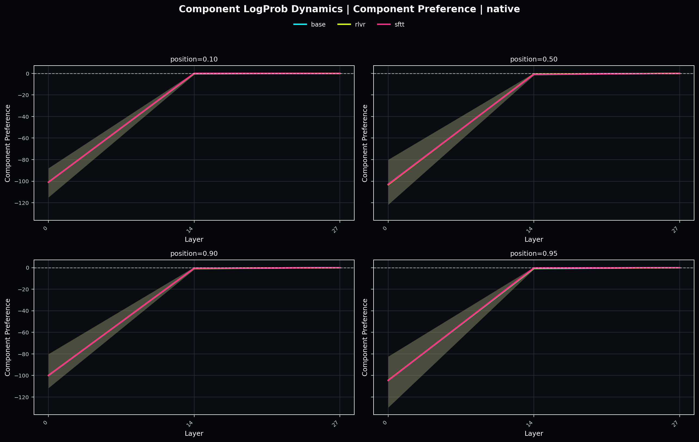       | 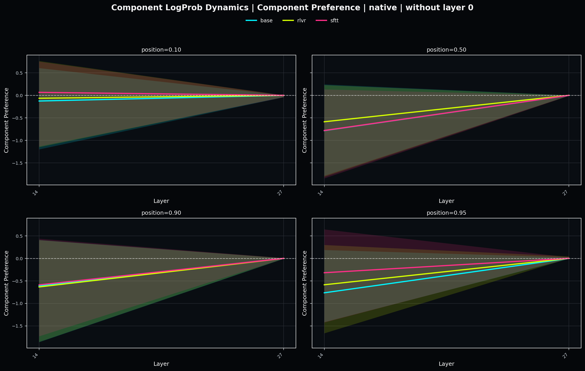

Staying on the zoomed-in graph, we can also notice some differences between the models:
In the initial position, we see that the sftt model is the one that generally tends towards more positive values. In the two subsequent positions, the differences between the models diminish, with the rlvr model being the one with the highest value at position 0.50; it nevertheless remains below zero, indicating that the attention is the component pointing more towards the target token. In the last position, a clear hierarchy is confirmed: the base model is the one where the attention points the most to the target token, while in the sftt model, the attention has a less marked effect on the log-prob.