## Abstract 
Reinforcement Learning from Verifiable Rewards (RLVR) improves problem-solving skills in LLMs. In this project, I will fine-tune open-weights models to investigate the underlying reasoning mechanisms acquired during RLVR. Training is conducted using the GSM8K dataset for mathematical reasoning and the HumanEval dataset for coding tasks. We aim to understand how RLVR enhances mathematical and algorithmic reasoning capabilities at a mechanistic level.

## Goal 
The academic community is currently debating how RLVR alters model parameters. Specifically, it remains unclear whether the model already possesses the necessary knowledge (with RLVR merely creating routing pathways to extract the correct answer) or if RLVR induces the creation of novel features.

Considering the transformer architecture as a residual stream manipulated by Attention Heads and Multi-Layer Perceptrons (MLPs), we aim to investigate the extent to which RLVR modifies internal representations versus merely acting as a behavioral wrapper.

To formalize this, we define two competing hypotheses:

*   **Steering Hypothesis (H0):** RLVR acts purely as a routing mechanism. It modifies the Attention circuits to steer pre-existing knowledge without creating new features in the MLPs.
*   **Representation Learning Hypothesis (H1):** RLVR forces the crystallization of new logical circuits, fundamentally altering the latent features encoded within the MLP layers.

To test these hypotheses, we analyze three distinct training phases:
1.   **Vanilla Phase:** The base pre-trained model before any domain-specific exposure.
2.   **Supervised Fine-Tuning (SFT) Phase:** The model trained via next-token prediction (acting as a baseline for formatting and basic knowledge).
3.   **RLVR Phase:** The model fine-tuned using RLVR on the same datasets.

By isolating these internal components, we study:
*   **Self-Attention:** To evaluate if RLVR establishes pathways toward the correct answer.
*   **MLP:** To check if RLVR alters weights or activations within the feed-forward layers, which would suggest the acquisition of new knowledge.

---

# Training Setup

## Supervised Fine-Tuning
For the SFT stage, I used the NuminaMath-CoT dataset. This provides the model with basic mathematical reasoning patterns, solution structures, and the desired response format required before applying RLVR.

## RLVR Training
I constructed a mixed mathematical dataset using GSM8K, MATH-Lighteval (filtered by level), and DAPO-Math-17k. While SFT teaches the model to imitate traces, RLVR optimizes the model toward solution trajectories that maximize verifiable correctness.

## RLVR Configuration
Using the Hugging Face `trl` library, specifically `GRPOConfig` and `GRPOTrainer`:
*   **Learning Rate:** 2e-6
*   **Max Completion Length:** 2000
*   **Loss Type:** DAPO (chosen for its effectiveness with variable completion lengths).
*   **Infrastructure:** DeepSpeed for memory efficiency and vLLM for fast generation sampling.

---

# Experiments

## Dataset Building
We constructed a dataset of internal activations extracted from the BASE, SFT, and RLVR versions of the model. To ensure comparability, we use the RLVR model to generate a completion, then feed that exact sequence into all three models to extract activations at the same textual positions.

The sequence consists of the prompt and the completion. For every model and selected layer, we save:
*   **Pre-residual:** The input stream entering the layer.
*   **MLP output:** The specific contribution of the MLP block.
*   **Attention output:** The specific contribution of the Self-Attention block.

In a standard transformer layer, the "middle" residual state is the sum of the **pre-residual** and the **attention output**. The final "post-residual" state is the sum of that **middle state** and the **MLP output**.

### Activation Dataset Reproducibility

To reproduce the activation dataset, run `get_activation_dataset` from `experiments/experiments_main.py`.

This function builds a shared token cache using a generator model, then replays the same prompt-completion sequences through all model variants to extract comparable activations.

### Main inputs

- `gen_model`: model used to generate the completion.
- `gen_tokenizer`: tokenizer associated with `gen_model`.
- `gen_dataset`: dataset used for generation.
- `model_desc`: list of `(model_path, model_name)` pairs for the models to compare.
- `save_path`: directory where the activation dataset will be saved.
- `generator_name`: identifier of the model used for generation.
- `ood_dataset_name`: identifier of the evaluation dataset.
- `max_new_tokens`: maximum completion length used during generation.

### Saved files

Running the pipeline creates:

- `save_path/<dataset_name>.h5`: activation dataset in HDF5 format
- `save_path/<dataset_name>_metadata.pt`: lightweight metadata for the activation dataset
- `save_path/tokens_cache/<token_cache_prefix>.pt`: full token cache
- `save_path/tokens_cache/<token_cache_prefix>.jsonl`: JSONL export of the token cache

### Extraction procedure

1. The generator model produces one completion for each prompt in `gen_dataset`.
2. Prompt tokens and generated completion tokens are saved in a token cache.
3. The same full sequence (`prompt + completion`) is replayed through every model listed in `model_desc`.
4. Activations are extracted at the same token positions for all compared models.

### Current activation setup

At the moment, activations are extracted for:
- the first layer
- the middle layer
- the last layer

For each selected layer, the following activations are stored:
- `resid_pre_act`
- `attn_out_act`
- `mlp_out_act`

The saved token positions cover the full sequence:
- all prompt tokens
- all completion tokens

### HDF5 structure

```text
<dataset_name>.h5
│
├── <model_name_1>/
│   ├── index/
│   │   ├── sample_id
│   │   ├── start
│   │   ├── end
│   │   ├── prompt_len
│   │   ├── completion_len
│   │   └── total_len
│   │
│   ├── layer_00/
│   │   ├── mlp_out_act      # [total_tokens, d_model]
│   │   ├── attn_out_act     # [total_tokens, d_model]
│   │   └── resid_pre_act    # [total_tokens, d_model]
│   │
│   ├── layer_XX/
│   │   ├── mlp_out_act
│   │   ├── attn_out_act
│   │   └── resid_pre_act
│   │
│   └── layer_YY/
│       ├── mlp_out_act
│       ├── attn_out_act
│       └── resid_pre_act
│
└── <model_name_2>/
    ...
```

Here, `start` and `end` define the row span of each sample inside the flattened activation matrices.

### Notes
* The exact group names at the top level of the HDF5 file depend on the `model_name` values passed in `model_desc`.
* If you want to change which layers are extracted, modify the layer-selection logic in `extract_activation.py`.
* The token cache `.pt` file stores the generated tokenized dataset, while the `*_metadata.pt` file stores only lightweight metadata about the activation dataset.

## Component-Level Representation Comparison Summary

This analysis compares internal representations across three model training stages—**BASE**, **SFT**, and **RLVR**—to determine if fine-tuning causes large global changes in the geometry of Attention and MLP outputs. We compute **linear Centered Kernel Alignment (CKA)** between pairs of model-layer representations using two component outputs: `attn_out_act` and `mlp_out_act`. 

Activations of shape `[L, seq_len, d_model]` are sliced into `[N, d_model]` matrices using two distinct strategies.

---

### 1. Last Input Token 
Studiamo la geometria delle attivazioni nella posizione dell’ultimo token di input, cioè nello stato che condiziona la distribuzione del primo token generato dal modello.

#### MLP 
La geometria rimane globalmente molto simile tra i modelli, ma la riduzione della CKA negli ultimi layer indica che le differenze introdotte dal fine-tuning si concentrano soprattutto nei layer profondi.


Osservando la tabella dei valori numerici di **CKA** abbiamo la conferma : Le geometrie cambiano maggiormente nei layer piu' profondi
| Layer | base-sftt | base-rlvr | sftt-rlvr |
| --- | ---: | ---: | ---: |
| layer_00 | 1.0000 | 0.9999 | 0.9999 |
| layer_14 | 0.9965 | 0.9876 | 0.9908 |
| layer_27 | 0.9172 | 0.9511 | 0.9323 |
| mean | 0.9712 | 0.9795 | 0.9743 |

Il `layer_27` e' quello che mostra un cambiamento piu' grande, studiando questi cambiamenti possiamo notare che le geometrie del confronto `sftt-rlvr` sono piu' simili rispetto alle geometrie del confronto `base-sftt`, come gia' mostrato in [Filtering with Self-Attention and Storing with MLP One Layer Transformers Can Provably Acquire and Extract Knowledge](https://arxiv.org/pdf/2508.00901v3a) il supervised fine-tuning raffina le conoscenze, insidiate negli MLP, del modello base, addestrato su next-token-prediction (NTP), questo e' coerente anche con i valori di **CKA** osservati nella tabella.

Il fatto che base-rlvr sia più simile di base-sftt suggerisce che, almeno sull’ultimo token di input, RLVR non amplifica necessariamente lo spostamento geometrico introdotto da SFT. Una possibile interpretazione è che RLVR selezioni o riutilizzi alcune rappresentazioni già presenti nel modello base, invece di continuare semplicemente nella direzione geometrica introdotta da SFT.

Nei test successivi confrontiamo questi risultati con le attivazioni dell’attention, per verificare se lo stesso pattern si osserva anche nei moduli di routing.

### 2. Predictive completion mean
Vogliamo studiare l’intensità del cambiamento geometrico sulle posizioni che predicono i token della completion generata. Questo test aggrega le attivazioni lungo la sequenza di reasoning, permettendo di confrontare la geometria media usata dai modelli durante la generazione.

Prendiamo la sequenza di token corrispondente a tutti i token generati e calcoliamo la media sull'asse dei token: 
```python 
pred_start = prompt_len - 1
pred_end = prompt_len + completion_len - 1
act = act[:, pred_start:pred_end, :].mean(dim=1)
```

Grazie a questa struttura possiamo studiare come variano le geometrie dei modelli su attivazioni di token predetti durante gli step di reasoning.
Osservando le heat-map possiamo notare un pattern abbastanza ripetitivo : Le geometrie tra gli stessi layer di modelli diversi non cambiano eccessivamente

#### MLP
Nel MLP abbiamo un intensita' maggiore, maggiormente isolata sull'ultimo layer, infatti i layer `layer_00` e `layer_14` hanno geometrie molto simili se non identiche.
Osservando il layer_27, notiamo una riduzione più marcata della CKA, quindi una maggiore differenza geometrica tra i modelli.


Anche osservando la tabella dei valori completi di **CKA** si conferma questo pattern : 
| Layer | base-sftt | base-rlvr | sftt-rlvr |
| --- | ---: | ---: | ---: |
| layer_00 | 1.0000 | 0.9998 | 0.9998 |
| layer_14 | 0.9890 | 0.9885 | 0.9871 |
| layer_27 | 0.9165 | 0.8945 | 0.9561 |
| mean | 0.9685 | 0.9609 | 0.9810 |

I layer piu' profondi sono quelli che hanno una maggior variazione di geometria. Possiamo anche notare come le geometrie tra `sftt-rlvr` le geometrie sono molto piu' simili rispetto a `base-rlvr`, al contrario di quanto visto sulle attivazioni dell'ultimo token di input.

Durante la generazione della completion, la geometria di rlvr risulta più vicina a quella di sftt che a quella del modello base. Questo suggerisce che RLVR preservi una parte rilevante della struttura rappresentazionale introdotta da SFT durante la generazione del reasoning.

#### Attention 
L'attention mostra geometrie molto piu' simili tra loro rispetto a quelle dell'MLP, dalla heat-map non si evidenziano cambi facilmente notabilis.


Guardando la tabella dei valori di **CKA** possiamo notare due pattern interessanti : 
- Le geometrie dell'attention del modello `base` e del modello `sftt`  sono piu' vicine rispetto alle geometrie dell'MLP
- Le geometrie dell'attention del modello `sftt` e del modello `rlvr`  sono piu' vicine rispetto alle geometrie dell'MLP
| Layer | base-sftt | base-rlvr | sftt-rlvr |
| --- | ---: | ---: | ---: |
| layer_00 | 1.0000 | 0.9999 | 1.0000 |
| layer_14 | 0.9982 | 0.9915 | 0.9919 |
| layer_27 | 0.9663 | 0.9609 | 0.9736 |
| mean | 0.9882 | 0.9841 | 0.9885 |

[A Mathematical Framework for transformer Circuits](https://transformer-circuits.pub/2021/framework/index.html#splitting-attention-head-terms-into-circuits) Poiché qui misuriamo attn_out, il risultato non identifica direttamente cambiamenti nei pattern di routing QK. Indica piuttosto che l’output scritto dall’attention nel residual stream rimane geometricamente più stabile rispetto agli output MLP. Nel setup studiato, la maggiore stabilità geometrica di attn_out suggerisce che le differenze introdotte da SFT e RLVR siano più visibili negli MLP che nell’output dell’attention. Questo non esclude un ruolo dell’attention, ma indica che il cambiamento non emerge chiaramente da questa specifica misura.

Le attivazioni nei confronti sono molto simili, cio' non indica che l'attention avrebbe predetto distribuzioni di token molto simili, ma osservando i cambi delle geometrie possiamo evidenziare che `sftt` e `rlvr` hanno impattato maggiormente sugli MLP.
Da queste due tabelle possiamo evidenziare che, seppur marginali, esistono dei cambi nelle geometrie dei diversi componenti, con un MLP che riceve un intensita' di cambiamento, in media, maggiore rispetto all'attention.

### 3. Position Completion
In questo modo possiamo studiare come cambia la geometria delle attivazioni in diverse posizioni normalizzate della completion, verificando se le differenze tra modelli aumentano man mano che il reasoning procede.
```python 
rel_idx = int(round((completion_len - 1) * normalized_pos))
rel_idx = _clamp(rel_idx, 0, completion_len - 1)
abs_idx = completion_start + rel_idx
return act[:, abs_idx, :]  
```

In questo modo possiamo studiare in che modo le geometrie delle attivazioni dei tre modelli cambiano a lunghezza di token della completion, e' utile per vedere con che geometria i modelli rappresentano il reasoning.

#### MLP 
Osservando la heat-map possiamo vedere che le geometria tra i layer rimangono molto simili : 
- `layer_00` : Le geometrie rimangono molto simili 
- `layer_14` : Anche qui le geometrie rimangono molto simili 
- `layer_27` : Qui si percepisce la maggiore differenza delle geometrie, seppur marginale


Osservando la tabella che restituisce il punteggio completo di **CKA** : 
| Layer | base-sftt | base-rlvr | sftt-rlvr |
| --- | ---: | ---: | ---: |
| layer_00 | 1.0000 | 0.9996 | 0.9996 |
| layer_14 | 0.9807 | 0.9688 | 0.9718 |
| layer_27 | 0.9632 | 0.9301 | 0.9490 |
| mean | 0.9813 | 0.9662 | 0.9735 |


Si riconferma il pattern visto precedentemente, i blocchi di MLP sono quelli che hanno un intensita' di cambiamento delle geometrie meggiori rispetto all'attention.
Le attivazioni degli MLP del primo `25%` dei token generati mostrano come la geometrie siano vicine, indicando che per generare il primo `25%` dei token i modelli non si spostino eccessivamente tra di loro.

Arrivando fino al `75%` dei token generati ci avviciniamo al pattern visto precedentemente.
| Layer | base-sftt | base-rlvr | sftt-rlvr |
| --- | ---: | ---: | ---: |
| layer_00 | 1.0000 | 0.9995 | 0.9995 |
| layer_14 | 0.9873 | 0.9730 | 0.9757 |
| layer_27 | 0.9788 | 0.9249 | 0.9453 |
| mean | 0.9887 | 0.9658 | 0.9735 |

Al 75% della completion, la differenza maggiore emerge ancora nel confronto `base-rlvr` , mentre `sftt-rlvr` resta più vicino. Questo suggerisce che, nelle fasi intermedie della completion, RLVR si separi maggiormente dal modello base mantenendo una geometria più vicina allo SFT.

Arrivando fino al `95%` dei token generati  il pattern si conferma : 
| Layer | base-sftt | base-rlvr | sftt-rlvr |
| --- | ---: | ---: | ---: |
| layer_00 | 0.9999 | 0.9995 | 0.9995 |
| layer_14 | 0.9582 | 0.9135 | 0.9478 |
| layer_27 | 0.7016 | 0.6826 | 0.8696 |
| mean | 0.8866 | 0.8652 | 0.9390 |

Stavolta abbiamo geometrie molto piu' differenti tra di loro, il pattern si riconferma essere maggiore nei layer profondi.

Le geometrie dell'ultimo layer si spostano di molto, soprattutto in `base-rlvr` indicando che le attivazioni sono cambiate tra i due, questo forte calo della CKA nei confronti con il modello base suggerisce che, verso la fine della completion, SFT e RLVR attraversino regioni rappresentazionali più distanti da quelle del modello base. Una possibile ipotesi è che i layer MLP profondi codifichino o combinino feature più specifiche del reasoning matematico.
La differenza piu' marginale resta tra `sftt-rlvr` indicando che tra le due versioni del modello le geometrie delle attivazioni sono molto piu' simili, questo potrebbe esser dovuto al fatto che le feature dell'MLP di `rlvr` riescano ad attivarsi maggiormente rispetto alle feature di `sftt`, proprio perche' RLVR potrebbe aver reso più sistematico l’utilizzo di alcune rappresentazioni già acquisite durante SFT.

#### Attention 
Anche per l’attention le geometrie rimangono molto simili. Rispetto agli MLP, i cambiamenti sono più contenuti: nella heat-map le differenze visibili negli MLP risultano quasi del tutto assenti.


Osservando la tabella delle attivazioni fino al `25%` dei token generati possiamo notare un cambio delle geometrie molto piu' contenuto rispetto agli MLP. I punteggi in inoltre rimangono molto allineati con quelli visti nel test scorso.
| Layer | base-sftt | base-rlvr | sftt-rlvr |
| --- | ---: | ---: | ---: |
| layer_00 | 1.0000 | 0.9999 | 0.9999 |
| layer_14 | 0.9893 | 0.9797 | 0.9805 |
| layer_27 | 0.9859 | 0.9781 | 0.9810 |
| mean | 0.9917 | 0.9859 | 0.9871 |

Andando fino al `95%` dei token generati notiamo lo stesso pattern notato nell'MLP, le geometrie si differenziano maggiormente : 
| Layer | base-sftt | base-rlvr | sftt-rlvr |
| --- | ---: | ---: | ---: |
| layer_00 | 1.0000 | 0.9999 | 0.9999 |
| layer_14 | 0.9579 | 0.9430 | 0.9673 |
| layer_27 | 0.8828 | 0.9153 | 0.9041 |
| mean | 0.9469 | 0.9527 | 0.9571 |

Il cambio nelle attivazioni dell'attention con maggior profondita' di reasoning potrebbe esser dovuto al fatto che l'attention abbia imparato nuovi pattern tra token, con questo potrebbe aver imparato a dare maggior attenzione a token che prima riteneva poco informativi.
A differenza degli MLP, nell’attention il confronto più distante non è sempre base-rlvr; al layer_27, il valore più basso è base-sftt. Questo suggerisce che i cambiamenti dell’attention siano più deboli e meno strutturati rispetto a quelli osservati negli MLP.

Poiché questo test misura attn_out e non direttamente le attention probabilities, non possiamo concludere che il modello abbia imparato nuovi pattern di routing. Possiamo però osservare che, verso la fine della completion, anche l’output dell’attention mostra una riduzione della similarità geometrica tra modelli. 

a letteratura recente su RLVR evidenzia che l’addestramento con reward verificabili può essere associato a dinamiche di riduzione dell’entropia e a una maggiore concentrazione della distribuzione sui token. Tuttavia, dai soli risultati CKA su attn_out non possiamo attribuire questa dinamica all’attention. Per verificarlo sarà necessario confrontare logit entropy, Logit Lens/Logi-Lens e, separatamente, interventi causali su MLP e attention[Towards a Mechanistic Undestanding of LRM - A survey of training and inference.](https://arxiv.org/pdf/2601.19928) i 

L’MLP mostra maggiore variazione geometrica rispetto all’attention, perché i valori di CKA sono più bassi.
| Attention         | 0.9469    | 0.9527     | 0.9571   |
| **MLP**           | **0.8866** | **0.8652** | **0.9390** |

### Interpretation 
I risultati CKA mostrano che SFT e RLVR non producono una riorganizzazione globale delle rappresentazioni, dato che la similarità geometrica resta alta nella maggior parte dei layer e delle posizioni. Tuttavia, le differenze aumentano nei layer profondi, soprattutto negli output MLP e nelle posizioni finali della completion. Questo suggerisce che il fine-tuning agisca maggiormente sulle componenti MLP profonde durante la generazione del reasoning, mentre l’output dell’attention rimane più stabile. La maggiore vicinanza tra sftt e rlvr durante la completion indica inoltre che RLVR sembra preservare parte della struttura rappresentazionale introdotta da SFT, piuttosto che produrre una geometria completamente nuova.

## 2. Linear Probing & Causal Intervention
### 2.1 Netive-Logit Lens
Logit Lens e' stato effettuato utilizzando le attivazioni salvate in precedenza, tramite questo esperimento vogliamo analizzare come evolvono le distribuzioni di probabilita' sui token in output in base alla percentuale di completion dentro le attivazioni utilizzate. Il setup e' il seguente : 

Prendiamo tutte le attivazioni salvate nel nostro dataset e ricostruiamo un approssimazione dei residui interni : `attention_residual = resid_pre_act + attn_out_act` e `resid_post = attention_residual + mlp_out_act`, successivamente estraiamo le prediction-lens dei tre modelli ottenendo : 
- `base_lens`
- `rlvr_lens`
- `sftt_lens`

Ogni modello utilizza la propria prediction-lens nel setting di `lens = native`, mentre utilizzano una prediction-lens condivisa nel set di `lens = shared`

Ad ogni lens diamo come input il `residual_module` calcolato su una percentuale di token della completion : `10%`, `50%`, `90%` e `95%`, andiamo poi a studiare l'evoluzione di diverse metriche rispetto ai moduli, alla profondita' del modello, basandoci quindi sui layer, e infine in base alla percentuale di token della completion.
Le metriche che andremo ad analizzare sono mediate lungo l'asse dei sample, all'interno del nostro codice ogni metrica viene salvata con una shape `[B, L]` dove `L` rappresenta il layer e `B` il batch, per studiare le metriche mediamo su `B`. Purtroppo il setup hardware su cui sono stati girati gli esperimenti e' limitato e di conseguenza anche il cambio sui sample e' limitato.
#### Component-Level Logit Divergence: Top-K Overlap and Symmetric KL
Utiliziamo Jaccard per misurare l'overlap dei top-k token predetti dai modelli, mentre Symmetric KL Divergence e' utilizzanto per quantificare quanto le distribuzioni sul vocabolario di output differiscano. 
Per ogni modello, posizione normalizzata, modulo e layer raccogliamo : 
- Attivazione selezionata 
- Applichiamo la prediction lens sull'attivazione 
- Otteniamo i logits di shape `[L, V]` tramite la prediction-lens

*Jaccard*
Estriamo i top-k token : `top_ids = logits.top(k = top_k, dim = -1).indices`
```python
matches = top_ids_a.unsqueeze(-1) == top_ids_b.unsqueeze(-2)
intersection = matches.any(dim=-1).sum(dim=-1).float()
union = 2 * K - intersection
jaccard = intersection / union
```

*Summetric KL*
```python
log_p = logits_a.log_softmax(dim=-1)
log_q = logits_b.log_softmax(dim=-1)

p = log_p.exp()
q = log_q.exp()

kl_pq = (p * (log_p - log_q)).sum(dim=-1)
kl_qp = (q * (log_q - log_p)).sum(dim=-1)

dkl = 0.5 * (kl_pq + kl_qp)
```

**DKL Attention**
Nel primo layer le distribuzioni sono tendono ad essere tutte molto simili tra le coppie confrontate. Anche nell'ultimo layer le distribuzioni tendono ad essere molto simili tra loro. Dalla posizione 0.90 possiamo notare come (base, rlvr) tende ad avere un punteggio piu' alto, che indica che le distribuzioni dei due modelli siano leggermente piu' diverse, questo si nota sopratutto nella posizione 0.95. I punteggi maggiori si ottengono sul layer intermedio, indicando che e' qui dove le distribuzioni si allontanano maggiormente.


Il confronto (base, rlvr) e' quello che, nel layer intermedio, che da le distribuzioni piu' distanti, subito a seguire abbiamo (rlvr, sftt), mentre (sftt, base) danno le distribuzioni piu' vicine. In entrambi i confronti le distribuzioni si diversificano nel layer 14. Osservando i punteggi di (base, rlvr) e (rlvr, sftt) possiamo vedere come allo scorrimento della posizione i loro due punteggi si avvicinino, osservando l'evoluzione del layer intermedio nelle posizioni notiamo come i due punteggi non solo tendono ad aumentare ma anche ad avvicinarsi, sopratutto nella posizione 0.95

**DKL-MLP**
La coppia (base, sftt) continua ad esser quella con il punteggio piu' basso, indicando che i due modelli restituiscano distribuzioni molto simili, il tren che segue e' molto simile a quello gia' visto precedentemente. I punteggi delle coppie (rlvr, sftt) e (base, rlvr) nel primo layer di tutte le posizione e' aumentato rispetto a prima, mostra anche un pattern di crescita tra le posizioni, con la coppia (base, rlvr) che mostra un punteggio leggermente superiore a tutte le altre. Anche i punteggi dell'ultimo layer, sempre riguardanti queste due coppie di modelli, e' cambiato in diversi punti : Il primo e' l'ultimo layer della prima posizione, dove le due coppie convergono allo stesso punteggio che e' quello piu' alto, indicando distribuzioni simili ma non troppo, seguendo le posizioni possiamo notare come i punteggi si riappiattiscano nella posizione 0.50 per poi riprendere a distanziarsi in seguito, il distanziamento piu' forte e' quello in posizione 0.95 dove le distribuzioni di (base, rlvr) sono quelle piu' diverse.


Le coppie (base, rlvr) e (rlvr, sftt) mostrano punteggi piu' alti rispetto a prima, oltre a questo mostrano anche un distanziamento maggiore rispetto a quello visto in **DKL-Attention**, soprattutto nelle posizioni 0.10 e 0.50, nella posizione 0.90 invece accade l'opposto : In **DKL-Attention** i due punteggi rimangono circa distanti, mentre qui i due punteggi quasi convergono sullo stesso punto.

**Conclusioni**
L'aggiunta del segnale del MLP ha un impatto evidente sulle distribuzioni, differiscono poco nel layer iniziale e finale, in particolare si diversificano in quello intermedio, l'aumento di distanza sulle distribuzioni (base, rlvr) dell'ultimo layer e' un trend che nasce sopratutto nelle ultime posizioni. Per come sono costruite le completion le ultime posizioni, 0.90 e .95, i token al loro interno dovrebbero essere, con alta probabilita', i token associati alla risposta finale, il fatto che il MLP sposti la massa di probabilita' in quelle posizioni potrebbe indicare che il MLP abbia un effetto maggiore, rispetto all'Attention sulla distribuzione dei token della risposta finale.Un altro segnale che emerge e' quello che il MLP sposta maggiormente le distribuzioni del layer intermedio.


Guardando il delta notiamo come esso tenda ad esser maggiore o uguale a zero, se il delta e' uguale a zero significa che i due punteggi DKL sono uguali e si annullano, se invece il punteggio e' maggiore di zero significa che il punteggio DKL del MLP sia quello piu' grande e quindi quello che sposta maggiormente le distribuzioni. Osservando i grafici notiamo come i punteggi maggiori di zero siano sopratutto nel layer intermedio, in particolare per le posizioni 0.50 e 0.95, e nel layer iniziale della posizione 0.95. Questi due pattern confermano che il MLP sposti la distribuzione sopratutto nel layer intermedio, essendo il MLP associato all immagazzinamento della conoscenza e alla sua estrazione potremmo pensare che sia nel layer intermedio il punto in cui la conoscenza viene maggiormente estratta. Nell'ultima posizione notiamo come sia il layer iniziale quello i punteggi piu' alti, all'avanzare dei layer i punteggi convergono a zero, guardando pero' il uncertainty band la stima è meno stabile across samples: alcune completions mostrano un contributo MLP molto più divergente, altri mostrano un contributo attention più divergente o quasi nullo.

**Jaccard Attention**
La coppia (base, sftt) e' quella con piu' token in comune in tutti i layer e in tutte le posizioni. Nel primo layer della posizione 0.10 la coppia con meno token in comune e' (base, sftt), nel layer intermedio e finale il loro punteggio **Top-K Jaccard** converge con il punteggio (base, rlvr), i punteggi convergono agli stessi punti in tutti i layer delle posizioni 0.50 e 0.90, divergono nuovamente nell'ultimo layer della posizione 0.90 dove (base, rlvr) soni i modelli con meno token in comune. 


Tutti i confronti nel layer iniziale hanno molti token in comune, questo numero diminuisce nel layer intermedio e aumenta nuovamente nel layer finale, senza pero' raggiungere il punteggio del layer iniziale. Come gia' visto prima il layer intermedio e' quello in cui le distribuzioni tendono ad all'ontanarsi maggiormente, possiamo notare come il layer intermedio sia anche quello che restituisce una modesta diversita' di token rispetto agli altri layer.

**Jaccard MLP**
Le coppie (rlvr, sftt) e (base, rlvr) hanno gli stessi punteggi in tutti i layer delle posizioni 0.90 e 0.95, il numero di token in comune per i modelli in queste posizioni e' quindi il medesimo. (base, sftt) continua a restituire i punteggi piu' alti indicando che i modelli continuano a condividere molto token, i suoi punteggi seguono un pattern identico a quello visto in **Jaccard Attention**. Per tutte le le posizioni e confronti il layer iniziale e' quello con piu' token in comune, nel layer intermedio il numero diminuisce e resta stabile fino al layer finale, tranne per (rlvr, sftt) in posizione 0.50 dove all'ultimo layer i token in comune aumentano rispetto a quelli osservati nel layer intermedio. 

Nelle prime posizioni, seppur per layer diversi, la coppia (base, rlvr) e' quella che tende ad avere il numero di token comuni piu' bassi, osservando infatti i layer finali delle posizioni 0.10 e 0.50 notiamo come i due modelli restituiscano un punteggio piu' basso rispetto agli altri, lo stesso vale per il layer intermedio della posizione 0.10
Nella posizione 0.10 i modelli (rlvr, sftt) hanno piu' token in comune rispetto a quelli osservati prima.

**Conclusion**
Tendenzialmente i modelli (base, sftt) hanno molti token in comune, ne hanno molti sopratutto rispetto agli altri confronti, i modelli (base, rlvr) sono invece quelli che nelle prime posizioni tenedono ad avere meno token in comune, questo mostra come il modello rlvr strutturi il ragionamento iniziale con una semantica diversa rispetto agli altri modelli, semantica che resta vicina a quella del modello sftt.

L'aggiunta del MLP ha reso piu' stabili i token in comune tra il layer intermedio e quello finale, sopratutto nel layer finale ha restituto un numero di token molto piu' diverso rispetto a quello osservato con solo l'Attention. A confermarci cio' e' il grafico di **Jaccard Delta**, quando il grafico va sotto lo zero significa che l'attention restituisce token piu' in comune tra i due modelli.


Possiamo notare come (base, rlvr) sia sempre sotto lo zero nell'ultimo layer, indicando che sia l'MLP a incentiviare token diversi tra i due modelli. Come visto in [Towards a Mechanistic Undestanding of LRM - A survey of training and inference.](https://arxiv.org/pdf/2601.19928) i modelli RLVR affrontano due stage di training, nel secondo stage imparano ad usare i token ottimali. Osservando i nostri grafici e' plausibile pensare che possa essere il MLP a dare un contributo maggiore ai token ottimali sfruttando la conoscenza appresa, non abbiamo prove certe di questo ma e' un ipotesi da non escludere e non del tutto irrealistica.

#### Logits Log-probs

*Consigli per migliorare i test : 1) Aggiungere finestre di token 2) Bootstrap Confidence Intervals 3) Aumentare la densita' dei layer analizzati*

Dopo aver estratto i logits, applicando la lens sull'attivazione, calcoliamo la log-probabilita' su essi : `log_probs = logits.log_softmax(dim = - 1)`, dopo di che calcoliamo 
```python
delta_attn_logprob = attn_resid - resid_pre
delta_mlp_logprob  = mlp_resid - attn_resid
```

I due delta misurano quanto cambia la log-probabilita' del target token quando si aggiunge il corriespettivo contributo di Attention e MLP al residual stream.
Andremo poi ad analizzare anche il divario tra i due delta, questa analisi serve per confermare quale componente agisca maggiormente sulla log-probabilita' per predire il token di target, nello specifico analizzeremo `delta_mlp_logprob - delta_attn_logprob`.

**Delta Attention LogProb**
Osservando il grafico nel layer iniziale l'attention e' quella che sposta la distribuzione verso il token di target, nei layer piu' profondi invece, l'attention non porta cambiamento della log-prob.

Osservando il grafico che zooma sul layer intermedio e il finale notiamo come l'attention diminuisca il suo contributo al target token, nella posizione iniziale il suo effetto sulla log-prob e' quasi zero, nelle posizioni successive vediamo che l'effetto torna ad esser alto seppur piu' vicino a zero rispetto al layer iniziale.
Nell'ultima posizione notiamo anche la prima differenza sui modelli, in sftt l'effetto dell'attention e' minore rispetto a quello che ha su rlvr e base

|  |  |
| :---: | :---: |
|       |  

Nelle prime due posizioni le bande di incertezza vanno sotto lo zero, indicando che per alcuni sample sia il MLP a spostare la distribuzione per favorire il target token, nelle ultime due posizioni questo effetto ha una scala minore.

Per completezza e' stata effettuata un analisi con le attivazioni dell'ultimo token di input, qui il pattern e' leggermente opposto, al primo layer l'attention continua a puntare molto sul token di target, dal layer intermedio invece il contributo cala sotto lo zero, all'ultimi layer c'e' una risalita ma non supera lo zero, indicando un contributo quasi nullo. Per struttura della completion il token di target subito dopo l'ultimo token del prompt e' il token di apertura reasoning (<reasoning>), a tutti e tre i modelli viene indicato nel prompt di inserire <reasoning> all'inizio di ogni step di reasoning, i modelli rlvr e sftt sono anche stati addestrati a rispettare questa struttura.

|  |  |
| :---: | :---: |
|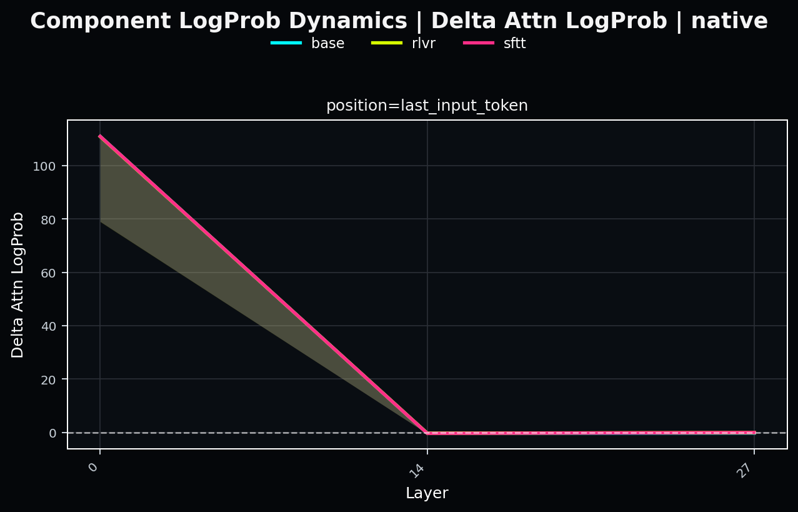       | 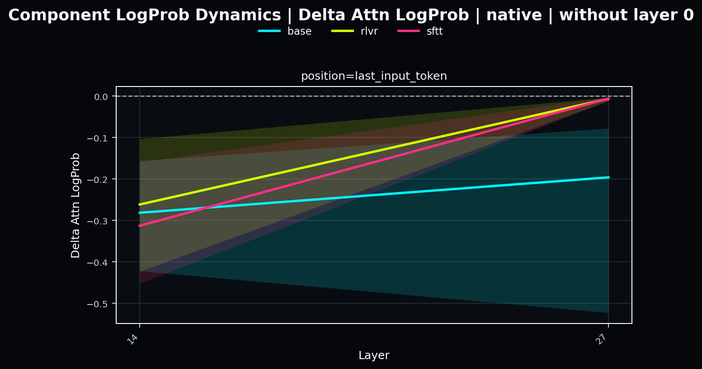 

Il modello in cui l'attention ha il contributo minore e' il modello base, guardando il grafico zoomato infatti notiamo come il punteggio di **Delta Attention LogProb** sia nettamente inferiore rispetto agli altri due modelli, il modello base nell'ultimo layer infatti non riesce a raggiungere lo zero.
Il modello rlvr e' invece quello dove l'attention ha il maggior contributo, seppur resta uguale o sotto lo zero 

**Delta MLP LogProb**
A riconferma di quanto visto precedentemente i grafici sul delta MLP log-prob mostrano un MLP che non favorisce il target token sopratutto nei primi layer. Anche qui le bande di incertezza mostrano che il MLP sposti lo score di probabilita' verso il token solo in alcuni sample.

|  |  |
| :---: | :---: |
|       | 

Effettuando uno zoom sugli ultimi due layer analizzati possiamo notare bande di incertezza piu' ampie che tenedono ad andare sopra lo zoero sopratutto nella prima e nell'ultima posizione. Nell'ultima posizione il MLP e' quello che sposta meno la distribuzione, nel modello rlvr l'effetto e' invece quello piu' marcato

A differenza dell'attention il MLP mostra un pattern piu' *altalenante*, guardando il grafico notiamo come nel primo layer il contributo del MLP sul token di target sia nettamente inferiore rispetto a quello dato dall'attention, nell'attenton infatti tutti e tre i modelli partivano da un contriobuto altissimo, qui notiamo l'opposto.

|

Il comportamento altalenante nasce dal layer intermedio, dove il contributo del MLP sale, mentre l'attention diminuisce. Nel layer finale invece sia il modello rlvr che quello sftt toccano lo zero, mentre nel modello base il deta resta sotto lo zero, stesso pattern gia' osservato nell'attention

**Components Preference**  Il component preference mostra come il **Delta Attention LogProb** sia quello tendenzialmente piu' grande, con l'avanzare dei layer pero' esso tende a diventare piu' piccolo, a conferma di cio' ci sono anche le bande di incertezza, che mostrano che **Delta MLP LogProb** in alcuni sample sia maggior, indicando che in quei sample sia il MLP a spostare gli score sul target token. L'effetto si nota maggiormente nella posizione 0.95, guardando infatti il grafico zoomato sul layer intermedio e il finale notiamo come la banda di incertezza del modello sftt sia quella che piu' propensa a valori positivi.

|  |  |
| :---: | :---: |
|       | 

Restando sul grafico zoomato possiamo anche notare alcune differenze tra i modelli : 
Nella posizione iniziale vediamo che il modello sftt sia quello che tende a valori generalmente piu' positivi, nelle due posizioni successive le differenze dei modelli si attenuano con il modello rlvr che, nella posizione 0.50, e' quello con il valore piu' alto, resta comunque sotto lo zero indicando che sia l'attention il componente a puntare maggiormente verso il token di target. Nell'ultima posizione si conferma una gerarchia chiara, il modello base e' quello in cui l'attention punta di piu' al token di target, mentre nel modello sftt l'attention ha un effetto meno marcato sulla log-prob.

## 3. Activation Patching
Per misurare gli effetti del patching sono state utilizzate in tutto sei metriche divise in due gruppi : Il primo gruppo serve per misurare le differenze geometriche delle attivazioni tra il modello ricevitore e il modello donatore : 
- **Cosine Similarity** : Per misurare quanto i due vettori delle attivazioni puntano nella stessa direzione.
Viene calcolata tra l'attivazione del ricevitore e del donatore, prima del patching : 
```python
cosine_sim = th.nn.functional.cosine_similarity(
    receiver_vec_flat.float(),
    donor_vec.float(),
)
```

- **Delta Norm** : Misura la distanza auclidea tra i vettori delle attivazioni tra il donatore e il ricevitore nel punto patched.
```python
delta = receiver_vec_flat - donor_vec 
delta_norm = delta.norm()
```
- **Activation relative delta norm** : La grandezza della differenza donor-receiver relativa alla norma dell’attivazione del receiver.
Anche qui le attivazioni analizzate sono tra donatore e ricevitore.
```python
rel_delta_norm = delta_norm / (receiver_vec_flat.norm() + 1e-12)
```

Il secondo gruppo di metriche e' il gruppo che misura gli effetti causali dell'introduzione dell'attivazione del modello donatore : 
- **Delta Logit Difference** : Quanto il patch aumenta o diminuisce il margine del token target rispetto alla migliore alternativa del receiver 
- **Logit Difference Recovery** : Frazione di recupero del margine target-vs-foil del donor, ottenuta dal modello patched
- **Recovery Score** : Quanto il patch sposta il receiver verso il donor sulla log-probabilità del token target

Nelle sezioni a seguire analizzeremo PATCHED <- DONOR utilizzando tutte le metriche elencate sopra.
### 3.1 Rescue patch BASE ← RLVR
#### 3.1.1 MLP Activation vs Attention Activation Completion
Analiziamo gli effetti locale del patching negli output dei singoli moduli MLP e Attention, in questo test gli output non si trovano nel residual stream.
Iniziamo analizzando le metriche geometriche : 
**Cosine Similarity**
Osservando i grafici della cosine similarity calcolata sulle attivazioni del MLP notiamo come nel primo layer, per tutte le posizioni, le direzioni dei vettori siano le stesse, tra base e rlvr quindi le attivazioni locali dei moduli non hanno drastici cambi di direzioni.

Nel layer intermedio i grafici mostrano punteggi leggermente piu' bassi, ma non abbastanza da indcare cambi direzionali grandi. 

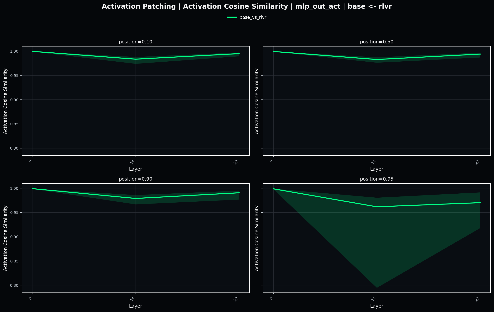

I valori piu' bassi si possono osservare nelle bande di incertezza sull'ultimo layer e il layer intermedio, essendo bande di incertezza queste indicano soltanto che ci sia una buona percentuale di sample in quell'area di valori.

Nell'attention i valori della **Cosine Similarity** sono leggermente piu' bassi rispetto a quelli osservano nel MLP, questo vale sia per i valori mediati sia per le bande di incertezza.
Osservando il grafico notiamo infatti che le bande di incertezza tendino ad essere piu' ampie rispetto a quelle osservate nel MLP, tranne nell'ultimo layer dell'ultima posizione, cio' implica che ci siano percentuali di sample piu' forti che raggiungono valori piu' bassi.

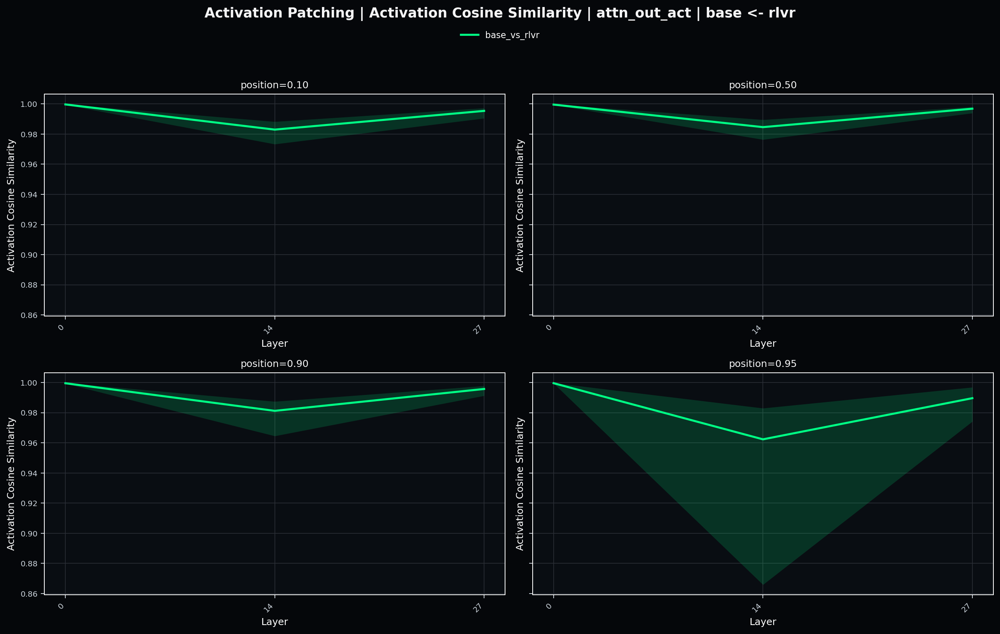

Anche osservando la media pura notiamo cambi direzionali piu' intensi di quelli osservati nel MLP. Tra il modello base e il modello rlvr notiamo quindi cambi direzionali delle attivazioni locali piu' intensi nell'Attention, nonostante i cambi direzionali rimangono bassi in entrambi i moduli locali

---

**Act Delta Norm**
Nel MLP piu' andiamo nei layer profondi piu' la distanza tra le due attivazioni si fa marcata, la distanza maggiore la osserviamo nell'ultimo layer su tutte le posizioni. Il primo layer in tutte le posizioni mostra distanze molto vicine che si allontanano dal layer intermedio, guardando i valori del delta su esso notiamo che le distanze diventano piu' grandi man mano che andiamo in profondita' con la completion.

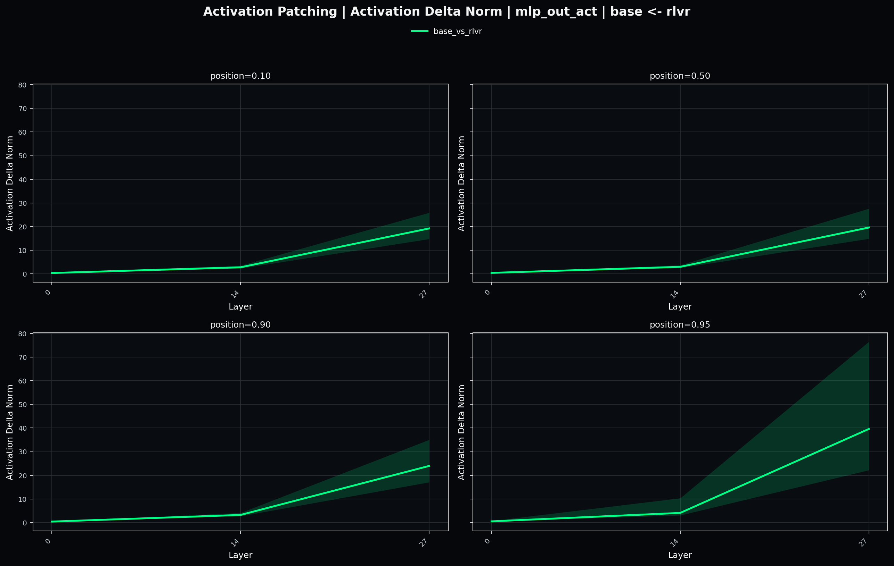

Lo stesso pattern lo notiamo anchje sull'ultimo layer, e' quello che in tutte le posizioni ha i punteggi della **Delta Norm** piu' alti, sopratutto nell'ultima posizione dove le bande di incertezza mostrano punteggi al di sopra della media, ci sta quindi una forte percentuale di sample per i quali le attivazioni sono molto distanti.

Nell'attention il pattern e' il medesimo, nei primi layer le distanze sono molto ravvicinate e si allontanano dai layer profondi, ifatti il pattern del layer intermedio e dell'ultimo layer si ripetono anche qui.

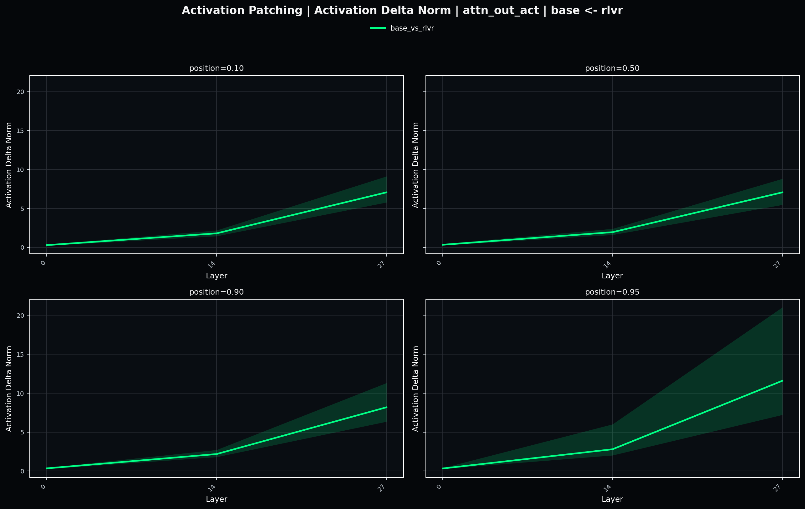

Nonostante i pattern si ripetano le distanze delle attivazioni dell'attention sono meno lontane di quelle del MLP. Le ultime due posizioni mostrano anche maggior rumore, nell'attention possiamo quindi dire che ci sono percentuali maggiori di sample in cui le attivazioni si distanziano rispetto al MLP che si mantiene piu' stabile.

---

**Act Relative Delta Norm**
Nelle prime due posizioni la distanza tra le attivazioni del donatore e quelle del ricevitore, in rapporto alla distanza delle attivazioni del ricevitore, non cambia moltossimo, questo vale sia per attention che per il MLP. Nel layer intermedio il rapporto aumenta, indicando che la distanza delle due attivazioni sia piu' lontana rispetto a quella originale.

Nelle ultime due posizioni, sopratutto nel layer intermedio e finale notiamo un aumento del rapporto, l'aumento piu' marcato e' nell'ultima posizione dove si nota maggiormente la differenza tra MLP e Attention

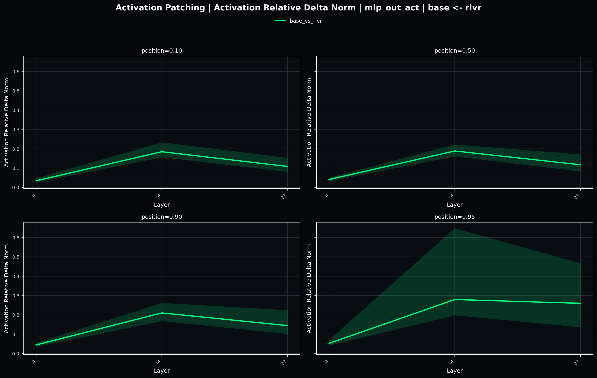

Nel MLP notiamo infatti che la distanza relativa nell'ultimo layer dell'ultima posizione mantenga circa lo stesso valore raggiunto dal layer intermedio, pattern contrario a quello osservato nelle posizioni precedenti. La banda di incertezza sull'ultimo layer suggerisce che per una buona percentuale di sample la distanza tra ricevitore e donatore aumenti in rapporto alla distanza del ricevitore dall'origine.

Nell'attention il pattern rimane stabile, anche l'ultimo layer dell'ultima posizione presenta una abbassamento della metrica, come nelel altre posizioni, qui le bande di incertezza mostrano un area molto piu' contenuta.

**Geometric Conclusion**
Le attivazioni locali del modello rlvr non puntano in direzioni differenti rispetto alle attivazioni del modello base, il distacco maggiore si osserva nel layer intermedio ma con un punteggio della **Cosine Similarity** che resta comunque alto, suggerendo che le attivazioni locali non cambino la loro direzione interna. La direzione normalmente definisce l'identita' delle feature che si sono attivate nell'attivazione analizzata, il poco cambio della **Cosine Similarity** suggerisce quindi che le feature fossero gia' presenti nel modello base, rlvr quindi non ha cambiato la rappresentazione interna delle feature.
A differenza della direzione la distanza delle attivazioni nello spazio aumenta, l'aumento della distanza suggerisce che il rlvr abbia reso piu' confidente il modello nella rappresentazione delle stesse feature gia' presenti nel modello base. La distanza maggiore e' osservata nel MLP, sia *pura* che in relazione all'attivazione originale, le distanze, seppur con intensita' diversa, tenedono ad aumentare maggiormente nel MLP, il MLP e' quindi il modulo che rende piu' chiara la rappresentazione interna dei token utilizzati all'interno del reasoning.
Questo modulo verra' approfondito nell'analisi di SVD.

---

**Recovery Score**
Anche qui Attention e MLP locali mostrano pattern molto simili nei primi due layer, il trend e' quello di un **Recovery Score** maggiore o uguale a zero per entrambi i moduli, quando lo score e' maggiore di zero significa che il patching sposta la distribuzione della LogProb verso il donor, quando invece lo socre e' uguale a zero il patching non ha avuto effetto sulla LogProb.

Per entrambi i moduli nei primi due layer analizzati il patching e' ininfluente, le differenze emergono dall'ultimo layer in tutte e quattro le posizioni.
Guardando i grafici notiamo come la media del MLP sia nettamente piu' alta di quella dell'attention, cio' significa che il MLP sposta la LogProb verso il modello donatore.

|  |  |
| :---: | :---: |
| 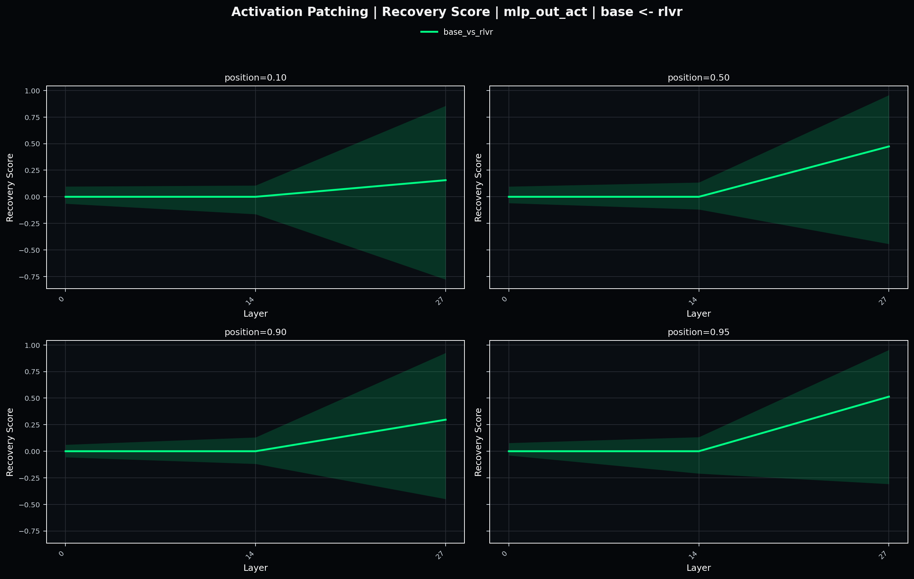 | 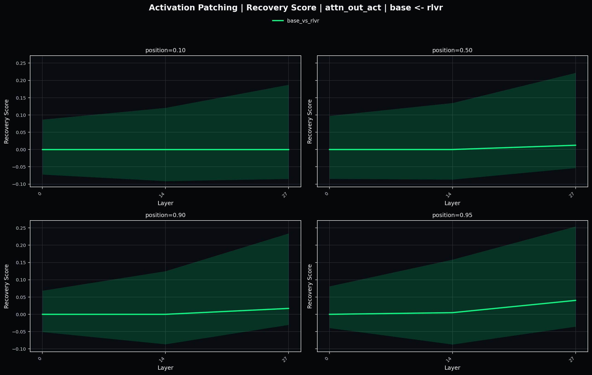 | 

Guardando alle bande di incertezza di entrambi i moduli notiamo come l'attention presenti un pattern maggiore di zero anche nel layer iniziale e intermedio, pattern non presente nel MLP, dove le bande di icertezza dei due layer restano molto vicine alla media. Ci sono pero' percentuali di sample che vanno anche in negativo, in quei sample l'attention e il MLP hanno allontanao la LogProb dal modello donatore.

Analizzando localmente l'ultimo layer, il MLP ha una media maggiore di zero e molto spesso vicino a 1 ma le bande di incertezza mostrano che per una percentuale di sample lo score e' minore di zero, le bande del MLP che tendono a valori negativi sono piu' ampie di quelle che si possono osservare nell'attention, cio' significa che per una percentuale piu' alta il MLP allontana la LogProb ottenuta dal modello patchato da quella ottenuta dal modello donatore rispetto all'attention. Nell'attention le bande di incertezza dell'ultimo layer rimangono comunque inferiori, nei valori positivi, rispetto alla media del MLP.

--- 

**Logit Difference Recovery**
Prima di effettuare l'analisi bisogna enunciare la definizione di foil : Il foil e' il token con score piu' alto che non e' il target token, quando osserviamo valori positivi vuol dire che il patching ha spostato il margine `target_token_score - foil_token_score` verso il modello donor, viceversa se i valori sono negativi il patching ha allontanato il margine dal modello donor.
I grafici mostrano che MLP e attention, come gia' osservato prima, seguono lo stesso pattern  : Layer iniziale e intermedio il patching non produce alcun effetto, dall'ultimo layer il patching ha influenza.

Osservando l'ultimo layer relativo al MLP il patching sposta il margine verso il donor in tutte le posizioni, la posizione con maggior spostamento e' quella intermedia dove il recuper del margine e' del 50%, nelle due posizioni a venire il recupero e' ancora presente ma presenta un intensita' minore. Osservando le bande di incertezza notiamo come nell'ultima posizione ci sia una serie di sample per il quale il recupero e' nettamente piu' vicino a 1 rispetto alla media, d'altro canto nelle tre posizioni precedenti notiamo come esistano due percentuali di sample distinte : In una il **Recovery Score** si avvicina di molto a 1, arrivando a recuperare il 60% del margine, nell'altra invece il **Recovery Score** e' nettamente piu' basso arrivando a valori negativi, per quella percentuale di sample il MLP allontana il margine tra target e foil dal donor fino al 40%


L'attention mostra un pattern diverso, la media e' costante su zero, indicando che il suo effetto in media e' nullo, le bande di incertezza pero' mostrano un pattern abbastanza positivo, le bande infatti mostrano prevalentemente un trend maggiore di zero, sopratutto nell'ultimi layer di tutte le posizioni. Nonostante il trend positivo i punteggi osservati nelle bande restano inferiori ai punteggi della media del MLP nella maggior parte dei casi.

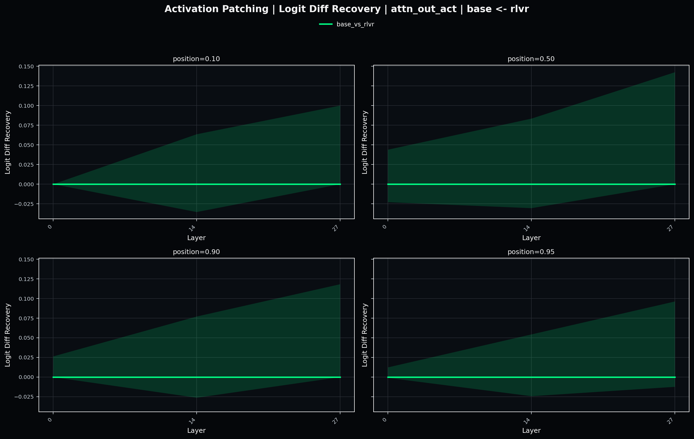

Esiste quindi una percentuale di sample del nostro dataset per il quale l'attention recupera il gap del margine dei due token sui due modelli, in media pero' l'effetto dell'attention e' praticamente nullo.

---

**Delta Logi Difference**
Questa metrica e' analoga/vicina a quella precedente, prima misuravamo quanto il patching diminuisse il gap tra il margine, qui invece quantifichiamo il margine. Quando il margine e' maggiore di zero significa che il patched model recupera il margine ottenuto dal modello donatore, se la metrica e' uguale a 1 il patched model ricostruisce lo stesso margine del donor, quando invece e' maggiore di 1 il patched model sposta il margine oltre.

Rispetto all'attention il MLP ha un impatto mediamente maggiore, in tutte le posizioni  l'ultimo layer presenta punteggi maggiori di zero, mai vicini a 1 o superiori. Il pattern e' abbastanza crescente seppur non costante. Le bande di incertezza presentano diverse aree, nel layer intermedio sono presenti aree maggiori  di zero e minori di zero, indicando che anche qui esistano percentuali di sample per i quali il MLP sposta il margine verso il donor oppure lo allontana. Questa suddivisione in due aree nel layer finale aumenta.

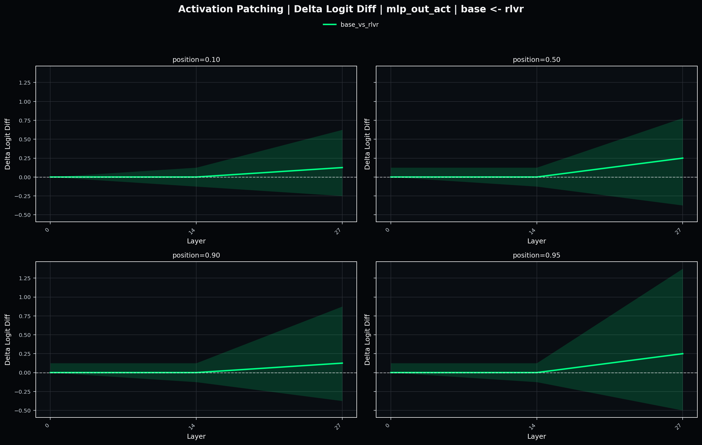

L'attention tren costante a zero tranne nell'ultimo layer delle ultime due posizioni, anche qui le bande di incertezza mostrano diverse aree.


### 3.2 Corruption patch RLVR ← SFT

<!-- ### 3.3 Interaction patch resid_mid & mlp_out -->

We train linear classifiers on the hidden states to predict correct intermediate reasoning steps. 
*   **Linear Probing Answer:** We take the activation vector for a reasoning token and pass it through a linear layer with a Softmax function to calculate the probability of specific classes among A, B, C or D.
*   **Activation Patching:** To establish causality, we inject specific activations from the RLVR model into the SFT model. This proves whether a specific MLP or Attention layer holds the critical features for successful reasoning.

## 3. Weight Distance & Spectral Analysis
To quantify parameter updates, we calculate the distance between the weight matrices of the models (using the L2 norm). 

To look deeper, we use **Singular Value Decomposition (SVD)** on the matrix representing the difference between weights. If RLVR is just a steering mechanism, these weight updates should show a "low rank"—meaning the changes are concentrated in a few specific routing heads rather than being spread across the MLP knowledge layers.
